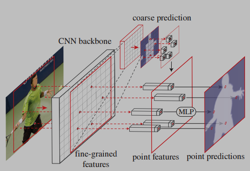
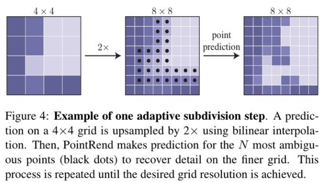
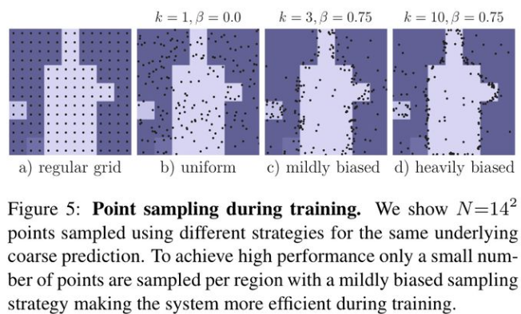

- Image Segmentation as Rendering
- Abstract
	- Take segmentation as rendering problem
	- point-based segmentation predictions at adaptively selected locations based on **iterative subdivision** algorithm
		- 迭代上采样
	- Solve the problem of "即物体边缘难以处理"
	- In typical semantic segmentation (like [[FCN]] and [[DeepLab]])
		- Downsample 16 times and upsample back
-
- 
- Process
  heading:: true
	- while 输出的分辨率 < 图片分辨率, i++:
		-
		  1. 对输出结果进行2倍双 [[bilinear interpolation]] 上采样得到 coarse prediction_i
			-
		-
		  2. 挑选出 N 个“难点”,即结果很有可能和周围点不一样的点 (例如物体边缘)
		-
		  3. 对于每个难点,获取其“表征向量”,“表征向量”由两个部分组成
			- 其一是低层特征(fine-grained features)通过使用点的坐标，在低层的特征图上进行 [[bilinear interpolation]] 获得(类似 RoI Align)
			- 其二是高层特征(coarse prediction),由步骤 1 获得
		-
		  4. 使用 [[MLP]] 对“表征向量”计算得到新的预测,更新 coarse prediction_i 得到 coarse prediction_i+1.
			- 这个 [[MLP]] 其实可以看做一个只对“难点”的“表征向量”进行运算的由多个 conv1x1 组成的小网络
			- Coarse mask features enable MLP to make different predictions at a single point that is contained by 2 or more boxes
	- 整个过程可以这么理解
		- 小明同学做题，现在有已知条件（coarse prediction_0，fine-grained features）,想求解答案（coarse prediction_k）
		- 发现直接求（双线性插值or其它方法）不够准确，那就一步一步来
		- 现在求coarse prediction_1，诶，发现有好多东西不知道，不能从 coarse prediction_0 直接得到怎么办？那就找出不知道的（“难点”）
			- 在 fine-grained features 里面找出对应的线索（ROIAlign-like 双线性插值）
			- 在结合 coarse prediction_0 得到**整体线索（“特征向量”）**
			- 求解（使用MLP计算）
			- 终于得到 coarse prediction_1了.
		- 再用同样的思路反复求解，直到 coarse prediction_k
- Adaptive subdivision step
  heading:: true
	- 
	- 
	-