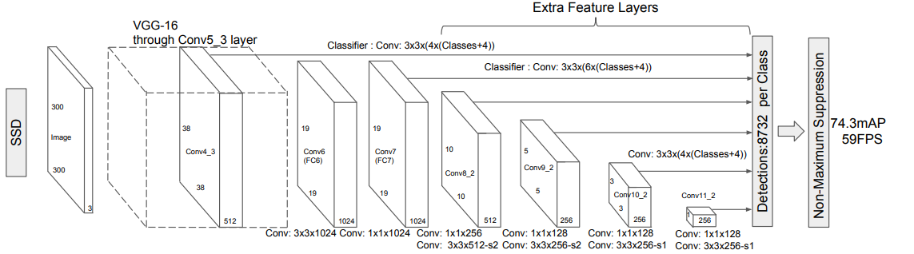
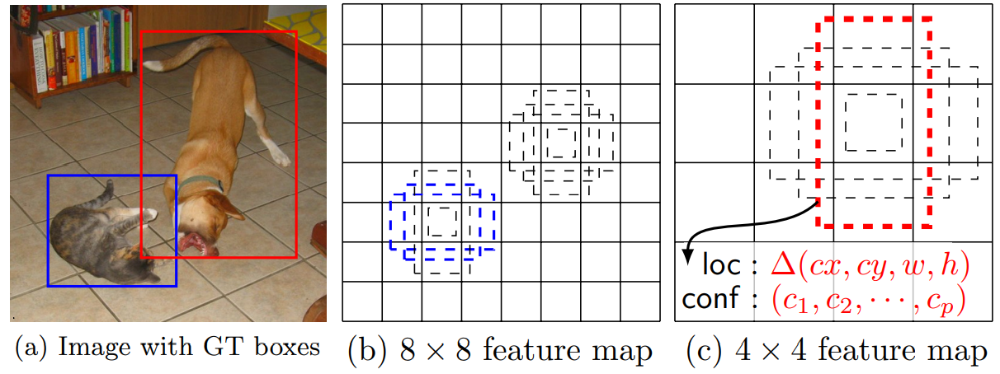

- SSD: Single Shot MultiBox Detector #toread
	- url: URL: [http://arxiv.org/abs/1512.02325](http://arxiv.org/abs/1512.02325)
	- Code: https://github.com/weiliu89/caffe/tree/ssd
	- PDF Attachments
		- [Liu et al_2016_SSD.pdf](zotero://open-pdf/library/items/HAB4F9E3)
	- [Local library](zotero://select/items/1_4WLCC6FP)
	- Abstract
		- Our approach, named **SSD**, discretizes the output space of bounding boxes into a set of **default boxes** over different aspect ratios and scales per feature map location.
			- At prediction time, the network generates scores for the presence of each object category in each default box and produces **adjustments**  to the box to better match the object shape.
			- Additionally, the network **combines predictions from multiple feature maps** with different resolutions to naturally handle objects of various sizes.
		- Advantages
			- Our SSD model is simple relative to methods that require object proposals because it completely eliminates proposal generation and subsequent pixel or feature resampling stage and encapsulates all computation in a single network.
			- This makes SSD easy to train and straightforward to integrate into systems that require a detection component.
		- Experimental results on the PASCAL [[VOC]], MS [[coco]], and ILSVRC datasets confirm that SSD has comparable accuracy to methods that utilize an additional object proposal step and is much faster, while providing a unified framework for both training and inference.
			- Compared to other single stage methods, SSD has much better accuracy, even with a smaller input image size. For $300\times 300$ input, SSD achieves 72.1% mAP on VOC2007 test at 58 FPS on a Nvidia Titan X and for $500\times 500$ input, SSD achieves 75.1% mAP, outperforming a comparable state of the art Faster R-CNN model.
- Structure
	- 
	- Backbone: [[VGG]]
		- (300,300,3) -> (150,150,64) -> (75,75,128) -> (38,38,256) -> (38,38,512)(**conv4_3**) -> (19,19,512) -> (19,19,1024)(**fc7**) -> (10,10,512)(**conv6_2**) -> (5,5,256)(**conv7_2**) -> (3,3,256)(**conv8_2**) -> (1,1,256)(**conv9_2**)
	- (1) Multi-scale feature map
	- (2) Use convolution to detect
		- instead of final layer as fully connection layer ([[YOLO]] v1)
	- (3) Set prior box (anchor)
		- {:height 319, :width 826}
		- 对于每个单元的每个先验框，其都输出一套独立的检测值，对应一个边界框，主要分为两个部分
			- 各个类别的置信度或者评分
				- $c$个类别，加上背景，$c+1$个置信度值
			- 边界框的location，包含4个值$(cx,cy,w,h)$
				- 说是真实预测值其实只是边界框相对于先验框的转换值，类似offset
					- transformation
					- encode
					- decode
			-