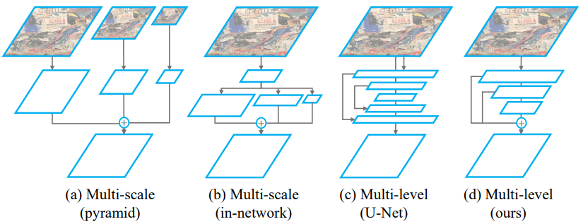

- Meta Data
  heading:: true
	- #title ASLFeat: Learning Local Features of Accurate Shape and Localization #reading
	- #code   https://github.com/lzx551402/ASLFeat   ( [[tensorflow]] )
	- #url  [http://arxiv.org/abs/2003.10071](http://arxiv.org/abs/2003.10071)
	- PDF Attachments
		- [Luo et al. - 2020 - ASLFeat Learning Local Features of Accurate Shape.pdf](zotero://open-pdf/library/items/XLW3VKJG)
		- zotero item: [Local library](zotero://select/items/1_VDDC3BJ6)
	- #abstract
		- mitigate 2 _limitations_ in the joint learning of local feature detectors and descriptors
			- estimate the local shape (scale, orientation, etc.) of feature points is often neglected
				- **shape-awareness** is crucial to acquire stronger geometric invariance.
			- localization accuracy of detected keypoints is not sufficient to reliably recover camera geometry
				- Not good for 3D reconstruction
		- Use [[Deformable Convolution Network(DCN)]] to densely estimate and apply local transformation
		- Use inherent feature **hierarchy** to restore spatial resolution and low-level details for accurate keypoint localization
			- multi-level detection (**MulDet**)
		- Use ^^peakiness^^ measurement to relate feature responses and derive more indicative detectoin scores
		- 在 [[D2-Net]] 基础上
			- 利用 [[Deformable Convolution Network(DCN)]] 保证 平移旋转的invariant
			- pyramid + [[coarse-to-fine]] 多层信息融合
				- 更精确
- Literature Review:
  heading:: true
	- Accuracy of other learning based keypoint extraction methods
	  id:: 605c4b6f-abef-4c73-a5e0-c31197183ad0
		- [[Lf-net]] and [[D2-Net]] empirically yield low precision in two-view matching or introduce large reprojection error in SfM tasks.
			- As the detections are from low-resolution feature maps ($1/4$ times original size).
	- 需要手动标点
		- [[Superpoint]] learns to upsample the feature maps with pixel-wise supervision from artificial points.
	- Computation of other learning based keypoint methods
	  id:: 605c4b6f-2675-4c51-a368-bb0485e222b6
		- [[R2D2]] employs [[dilated conv]] to maintain the spatial resolution but trades off **excessive GPU and memory usage**.
			- It handcrafted a selection rule to derive keypoints from the same feature maps that are used for extracting feature descriptors, which ^^couples^^ the capability of detectors and descriptor. ^^Good^^
	- Detections from ^^deepest^^ layer might not be able to identify low-level structures (corners, edges, etc) where keypoints are often located.
- Network Architecture
  heading:: true
	- {:height 273, :width 859}
- 1. Prerequisites
  heading:: true
	- Output features $\mathbf{y}$ of a _standard_ convolution for each spatial position $\mathbf{p}$ is:
		- ^^(1)^^                 $$ \mathbf{y(p)}=\sum\limits_{\mathbf{p}_n\in\mathcal{R}} w(\mathbf{p}_n)\cdot\mathbf{x(p+p_n)} $$,
	-
		- Input feature map $\mathbf{x}$
		- Regular grid $\mathcal{R}$ sampling over $\mathbf{x}$
		   [[dcn]] augments the regular convolution by additionally learning both sampling **offsets** $\{\Delta\mathbf{p}_n|n=1,\cdots,N\}$ and feature **amplitudes** $\{\Delta\mathbf{m}_n|n=1,\cdots,N\}$
		- where $N=|\mathcal{R}|$
		- rewrite Eq. (1) as:
		- ^^(2)^^                   $$ \mathbf{y(p)}=\sum\limits_{\mathbf{p}_n\in{\mathcal{R}}}w(\mathbf{p}_n)\cdot \mathbf{x(p+p_n}+\Delta\mathbf{p_n})\cdot\Delta\mathbf{m}_n $$
			- with feature amplitude $$ \Delta\mathbf{m}_n $$ limited to $$ (0,1) $$.
		-
- 2. DCN with Geometric Constraints
  heading:: true
	- Original free-form DCN predicts local transformation of [[DOF]]
		- like $9\times 2$ offsets for a $3\times 3$ kernel.
		- It can model complex deformation
			- but takes a risk of over-paramertizing local shape.
	- Affine-constrained DCN.
	  heading:: true
		- Similarity transformation is decompsed as
		- ^^(3) ^^             $$ \mathbf{S}=\lambda R(\theta)=\lambda\left( \begin{array}{cc}\cos(\theta) & \sin(\theta) \\ -\sin(\theta) & \cos(\theta) \end{array}\right) $$
	- WIth additional estimate of **shearing**, as a learnable problem by [[AffNet]]:
		- ^^(4)^^              $$  \begin{aligned} \mathbf{A} = & \mathbf{S}A^{\prime}=\lambda R(\theta)A^{\prime} \\= & \lambda \left( \begin{array}{cc}\cos(\theta) & \sin(\theta) \\ -\sin(\theta) & \cos(\theta) \end{array} \right) \left( \begin{array}{cc}a_{11}^{\prime} & 0 \\ a_{21}^{\prime} & a_{22}^\prime   \end{array} \right)\end{aligned} $$
			- where $det(A^{\prime})=1$.
			- The network predicts
				- 1 scalar for scaling $\lambda$
				- another 2 for rotation $\cos(\theta), \sin(\theta)$
				- the other 3 for shearing ($A^{\prime}$).
	- Homography-constrained DCN
	  id:: 60040400-994c-4a4f-bc52-315547409fd3
	  heading:: true
		- Homography (perspective) transformation $\mathbf{H}$
		  done:: 1616656578309
		- use Tensor [[DLT]]
			- solve 4-point parameterization of $\mathbf{H}$
		- $\Delta{\mathbf{p}}_n = \mathbf{Tp}_n-\mathbf{p}_n$
			- where $\mathbf{p}_n\in \mathcal{R}$
- 3. Selective and Accurate Keypoint Detection
  heading:: true
	- Refer to original [[D2-Net]]
		- score a keypoint regarding
			- 1) spatial responses
			- 2) [[channel-wise]] responses
	- {{embed ((605c055f-6bea-4393-9330-3dc44d17a069)) }}
	- **limitation** of [[D2-Net]]
	-
		- the [[Ratio-to-max]] of Eq. (5) above to evaluate [[channel-wise]] extremeness _weakly_ relates to the _actual_ distribution of all responses along the channel [[?]]
		   Keypoint **peakiness** measurement
		  heading:: true
		- We modify Eq. (5) with ^^Peakiness^^ as keypoint measurement:
			- ^^(5)^^            $$ \beta_{ij}^c=\text{softplus}(\mathbf{y}_{ij}^c - \frac{1}{C}\sum\limits_t \mathbf{y}_{ij}^t ) $$
				- where **softplus** activates the peakiness to a positive value
				- $\mathbf{y}_{ij}^c$ 是2D response of pixel $(i,j)$ in channel $c$
		- Similarly, for Eq. (4) we rewrite:
			- ^^(6)^^             $$ \alpha_{ij}^c=\text{softplus}\left(\mathbf{y}_{ij}^c-\frac{1}{|\mathcal{N}(i,j)|}\sum\limits_{(i',j')\in\mathcal{N}(i,j)}\mathbf{y}_{i'j'}^c \right) $$
	- MulDet Structure
	  heading:: true
		- 
		-