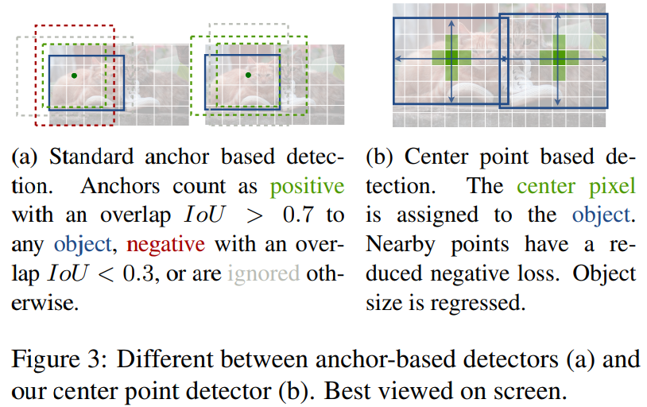

- Objects as Points #reading
	- Zotero Metadata
		- [http://arxiv.org/abs/1904.07850](http://arxiv.org/abs/1904.07850)
		- PDF Attachments
	- [Zhou et al_2019_Objects as Points.pdf](zotero://open-pdf/library/items/EF6CK3WB)
		- [[abstract]]:
			- [[anchor-free]]的一种
				- 从 [[cornernet]] 进行改进
				- [[one-stage]] object detection
			- Detection identifies objects as axis-aligned boxes in an image.
			- Most successful object detectors enumerate a nearly exhaustive list of potential object locations and classify each.
				- This is wasteful, inefficient, and requires additional post-processing.
			- In this paper, we model an object as a **single point** — the center point of its bounding box.
				- Our detector uses keypoint estimation to find **center points** and regresses to all other object properties, such as size, 3D location, orientation, and even pose.
				- 每个目标只对应一个anchor，只有它是positive sample，从 [[heatmap]]中提取的，所以不需要 [[NMS]] 筛选
				- 直接预测bbox的中心点和尺寸
				- Our center point based approach, CenterNet, is **end-to-end differentiable**, simpler, faster, and more accurate than corresponding bounding box based detectors.
		- zotero items: [Local library](zotero://select/items/1_2UB3K7BV)
- Preliminary
  heading:: true
	- ((60361390-93a2-4b9e-b2e6-d932868d45b5))
	- Produce a keypoint [[heatmap]] $\hat{Y}\in \left[0,1\right]^{\frac{W}{R}\times \frac{H}{R}\times C}$
		- $R$ output [[Stride]] ($4$ here)
			- 为输出对应原图的步长stride
			- Output stride downsamples the output prediction by factor $R$
				- 下采样因子4
		- $C$ keypoint type number
			- object detection 80
			- human joints 17
		- 使用$Y_{x,y,c}$表示heatmap中的第$c$个通道位置$(x,y)$处的值
			- $\hat{Y}_{x,y,c}=1$ corresponds to a detected keypoint (目标bbox的中心)
			- Otherwise $0$ background
		- For each **gt** keypoint $p\in \mathbb{R}^2$ of class $\mathcal{c}$
			- compute low-resolution equivalent $\tilde{p}=\lfloor \frac{p}{R} \rfloor$
			- splat all gt keypoints onto a [[heatmap]] using a [[Gaussian Kernel]]
				- $Y_{xyc}=\exp{\left(-\frac{(x-\tilde{p}_x)^2+(y-\tilde{p}_y)^2}{2\sigma^2_p}\right)}$
					- $\sigma_p$ is **object size-adaptive** standard deviation
				- 如果两个Gaussians of the same class overlap
					- take element-wise maximum
	- Training Objective
	  heading:: true
		- [[focal loss]]
			- $L_{k}=\frac{1}{N} \sum_{x y c}\left\{\begin{array}{cl}\left(1-\hat{Y}_{x y c}\right)^{\alpha} \log \left(\hat{Y}_{x y c}\right) & \text { if } Y_{x y c}=1 \\ \left(1-Y_{x y c}\right)^{\beta}\left(\hat{Y}_{x y c}\right)^{\alpha}  \log \left(1-\hat{Y}_{x y c}\right) & \text { otherwise }\end{array}\right.$
			- 对于easy example的中心点，适当减少训练比重，loss值
			- 当$Y_{x,y,c}=1$时，$(1-\hat{Y}_{x,y,c})$充当矫正的作用
				- $\hat{Y}_{x,y,c}$接近1时，说明比较容易检测，训练比重减少
				- 相反接近0时，说明没有学习到，加大训练比重
			- Otherwise, $\hat{Y}_{x,y,c}$预测值理应为0，但如果不为0且越来越接近1，这个损失的训练比重会加大
				- 而$(1-Y_{x,y,c})^{\beta}$对中心点周围的，和中心点靠得越近的点也作出了调整
				- 与中心点越近，$Y_{x,y,c}$越接近1，这个值越小
				- 相反越远,则这个值越大
				-
- Strucuture
  heading:: true
	- 
	-