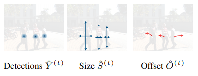
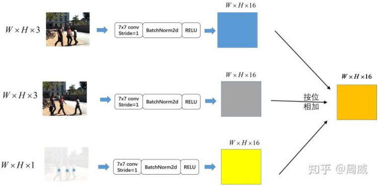
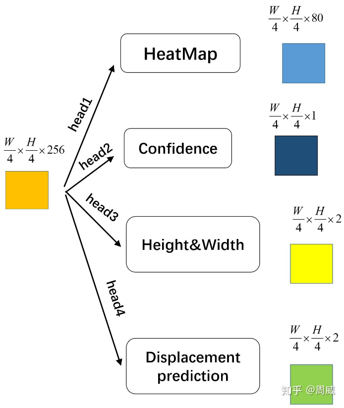

- Tracking Objects as Points #readdone
	- Zotero Metadata
		- [http://link.springer.com/10.1007/978-3-030-58548-8_28](http://link.springer.com/10.1007/978-3-030-58548-8_28)
		- PDF Attachments
	- [Zhou et al. - 2020 - Tracking Objects as Points.pdf](zotero://open-pdf/library/items/QF2LTQTZ)
		- [[abstract]]:
			- Tracking has traditionally been the art of following interest points through space and time. This changed with the rise of powerful deep networks.
				- Nowadays, tracking is dominated by pipelines that perform object detection followed by temporal association, also known as [[tracking-by-detection]].
					- 检测时间相当于detector时间(detect+embedding)+tracker时间 (data association)
				- We present a simultaneous detection and tracking algorithm that is simpler, faster, and more accurate than the state of the art.
			- Our tracker, **CenterTrack**, applies a detection model to a pair of images and detections from the prior frame.
				- Given this minimal input, **CenterTrack** localizes objects and predicts their associations with the previous frame.
					- CenterTrack is simple, online (no peeking into the future), and real-time.
			- It achieves 67.8% MOTA on the **MOT17** challenge at 22 FPS and 89.4% MOTA on the [[KITTI]] tracking benchmark at 15 FPS, setting a new state of the art on both datasets.
			- CenterTrack is easily extended to monocular 3D tracking by regressing additional 3D attributes. Using monocular video input, it achieves 28.3% AMOTA@0.2 on the newly released [[nuScenes]] 3D tracking benchmark, substantially outperforming the monocular baseline on this benchmark while running at 28 FPS.
			- 缺点:
				- local only, 只关联adjacent frames
					-
		- zotero items: [Local library](zotero://select/items/1_G9HIGQCK)
- Preliminaries
  heading:: true
	- [[centernet]]  produces a set of detections $\{(\mathbf{p}_i, \mathbf{s}_i)\}^{N-1}_{i=0}$ for each class.
		- $\mathbf{p}\in \mathbb{R}^2$ center point
		- $\mathbf{s}\in \mathbb{R}^2$ height and width of bbox
		- Low-resolution heatmap and a size map with downsampling factor $R=4$
		- Each local maximum $\hat{\mathbf{p}}\in \mathbb{R}^2$
			- also called **peak**, response strongest in a $3\times 3$ neighborhood
		- Offset
- Overview
  heading:: true
	- 
	- Input
		- current frame $I^{(t)}$
		- previous frame $I^{(t-1)}$
		- heatmap $T^{(t-1)}$rendered from tracked object centers
	- Output
		- center detection heatmap $\hat{Y}^{(t)}$
		- bounding box size map $\hat{S}^{(t)}$
		- offset map $\hat{O}^{(t)}$
	- Test time
		- Object sizes and offsets extracted from _peaks_ in the heatmap
	- 2 challenges
		- find all objects in every frame (including occluded ones)
		- associate them via **time**
	- {:height 375, :width 749}
		-
- 1. Tracking-conditioned Detection
  heading:: true
	- 在centernet基础上,寻找所有not directly visible objects in current frame
	- 因为每个object用一个single point表示
		- render all detections in a class-agnostic single-channel heatmap $H^{(t-1)}=\mathcal{R}(\{\mathbf{p}_0^{(t-1)}, \mathbf{p}_1^{(t-1)}, \cdots\})$
		- same Gaussian render function as in the training of detectors
		- only render objects with a confidence score bigger than $\tau$
	- 相比 [[centernet]] ,多出4个额外额输入通道
- 2. Association through offsets
  heading:: true
	- A simple displacement prediction to link objects across time
		- 不需要complicated distance metric or [[Graph Matching]]
	- Predict a 2D displacement as 2 additional output channels
		- $\hat{D}^{(t)}\in \mathbb{R}^{\frac{W}{R}\times \frac{H}{R}\times 2}$
	- For each detected object at location $\hat{\mathbf{p}}^{(t)}$
		- the displacement $\hat{\mathbf{d}}^{(t)}=\hat{D}^{(t)}_{\hat{\mathbf{p}}^{(t)}}$ captures the difference in location of the object in current frame $\hat{\mathbf{p}}^{(t)}$ and previous frame $\hat{\mathbf{p}}^{(t-1)}$
			- $\hat{\mathbf{d}}^{(t)}=\hat{\mathbf{p}}^{(t)}-\hat{\mathbf{p}}^{(t-1)}$
		- Learn the displacement
			- $L_{off}=\frac{1}{N}\sum\limits_{i=1}^{N}\left| \hat{\mathbf{d}}^{(t)} - (\hat{\mathbf{p}}^{(t)}-\hat{\mathbf{p}}^{(t-1)}) \right|$
				- where $\hat{\mathbf{p}}^{(t-1)}_i$ and $\hat{\mathbf{p}}^{(t)}_i$ are tracked gt objects
	- Greedy matching to associate with the closest unmatched prior detection
		- For each detection at position $\hat{p}$
		- match with position $\hat{p}-\hat{D}_{\hat{p}}$
		- in descending order of confidence $\hat{\omega}$
	- 如果在$\kappa$ radius里面没有unmatched prior detection
		- spawn a new tracklet
- 3. Training on vido data
	- Follow [[centernet]] and fine-tune based on the pretrained detector
		- train all predictions as multi-task learning
		- Same training objective $L_{off}$
	- Challenge is the realistic tracklet heatmap $H^{(t-1)}$
		- At inference time, it contain an arbitrary number of
			- missing tracklets
			- wrongly localized objects
			- false positives
		- 需要simulate the test-time error during training:   [[augmentation]]
			- locally jitter each tracklet $\mathbf{p}^{(t-1)}$ from the prior frame by adding Gaussian noise to each center
				- Render $p_i^{\prime}=(x_i+r\times \lambda_{jt}\times w_i , y_i+r\times \lambda_{jt}\times h_i)$
					- $r$ is sampled from [[Gaussian distribution]]
					- #practical  $\lambda_{jt}=0.05$
			- Randomly add false positives near gt object locations by
				- rendering a spurious noisy peak $p_i^{\prime}$ with probability $\lambda_{fp}$
			- simulate false negatives by randomly removing detections with probability $\lambda_{fn}$
	- {:height 623, :width 520}
	-