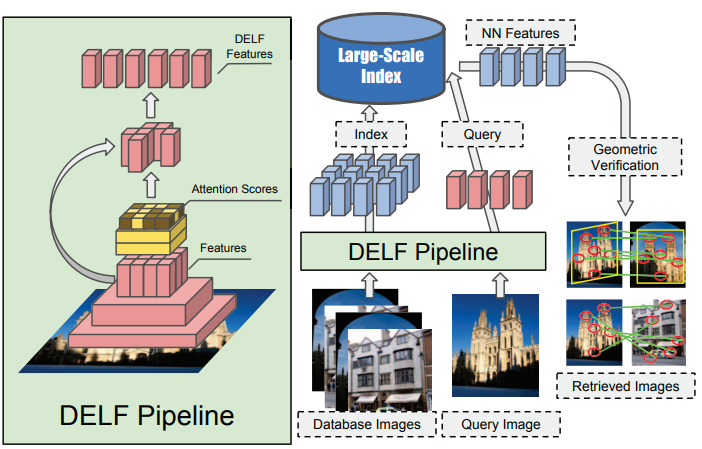

- Large-Scale Image Retrieval with Attentive Deep Local Features #readdone
	- Zotero Metadata
		- * Proceedings Title: [[2017 IEEE International Conference on Computer Vision (ICCV)]]
		- [http://ieeexplore.ieee.org/document/8237636/](http://ieeexplore.ieee.org/document/8237636/)
		- DOI: [10.1109/ICCV.2017.374](https://doi.org/10.1109/ICCV.2017.374)
		- PDF Attachments
	- [Noh et al. - 2017 - Large-Scale Image Retrieval with Attentive Deep Lo.pdf](zotero://open-pdf/library/items/LB9VXX9L)
		- [[abstract]]:
			- We propose an **attentive** local feature descriptor suitable for large-scale image retrieval, referred to as DELF (DEep Local Feature).
				- The new feature is based on CNN, which are trained only with image-level annotations on a landmark image dataset.
			- To identify semantically useful local features for image retrieval, we also propose an attention mechanism for keypoint selection, which shares most network layers with the descriptor.
				- This framework can be used for image retrieval as a drop-in replacement for other keypoint detectors and descriptors, enabling more accurate feature matching and geometric verification.
			- Our system produces reliable confidence scores to reject false positives—in particular, it is robust against queries that have no correct match in the database.
			- To evaluate the proposed descriptor, we introduce a new large-scale dataset, referred to as Google-Landmarks dataset, which involves challenges in both database and query such as background clutter, partial occlusion, multiple landmarks, objects in variable scales, etc.
			- We show that DELF outperforms the state-of-the-art global and local descriptors in the large-scale setting by significant margins.
			- 
		- zotero items: [Local library](zotero://select/items/1_7HWC72ZH)
- 1. Dense Localized Feature Extraction
  heading:: true
	- [[FCN]] to extract dense features
		- backbone from [[ResNet 50]]
		- [[Feature Pyramid]] to apply FCN for each level independently
	- Obtained features taken as **dense grid** of local descriptors
		- Features are localized based on [[receptive field]]
			- 使用receptive field的pixel coordinates of the center作为feature location
			- receptive field size for image at original scale $291 \times 291$
	- Input images are initially **center-cropped** to produce square images
		- rescaled to $250\times 250$
	- Random $224\times 224$ crops are then used for training
- 2. Attention-based Keypoint Selection
  heading:: true
	- {:height 250, :width 460}
	- 2.1 Learn with Weak Supervision
	  heading:: true
		- Train a landmark classifier with attention to _explicitly_ measure ^^relevance scores^^ for local feature descriptors
			- features are pooled by a **weighted sum** to train
				- weights are predicted by the **attention network**
			- Attention module generates an embedding for the whole input image
				- Then used to train a **softmax-based** landmark classifier
		- Formulate the training  by feature $\mathbf{f}_n \in \mathbb{R}^{d},n=1,\cdots,N$
			- jointly learn with attention model
			- Goal: learn a score function $\alpha(\mathbf{f}_n;\theta)$ for each feature
				- where $\theta$ denotes the parameters of function $\alpha(\cdot)$
					- restrict $\alpha(\cdot)$ **non-negative**
			- Output logit $y$ is generated by a weight sum of the feature vectors
				-
				  $$y=\mathbf{W}\left(\sum\limits_n \alpha(\mathbf{f}_n; \theta) \cdot \mathbf{f}_n\right)$$
					- $\mathbf{W}\in \mathbb{R}^{M\times d}$ represents the weights of the final [[fully connected layer]]  to predict $M$ classes
				- For training, use [[cross-entropy]] loss
					-
					  $$\mathcal{L}=-y^{*} \cdot \log{\left( \frac{\exp{(y)}}{1^{\top}\exp{(y)}}\right)}$$
						- $y^*$ is gt in [[one-hot]] representation
						- $1$ is one vector
	- 2.2 Training Attention
	  heading:: true
		- #practical  Learn feature representation and score jointly is not good
		- Employ 2-step training strategy
			- learn descriptors with fine-tuning
			- score function is learned given fixed descriptors
		-