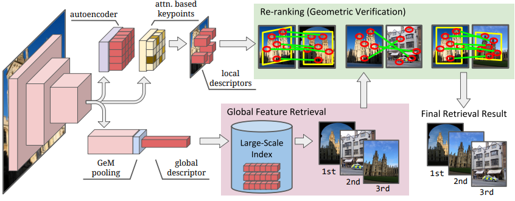
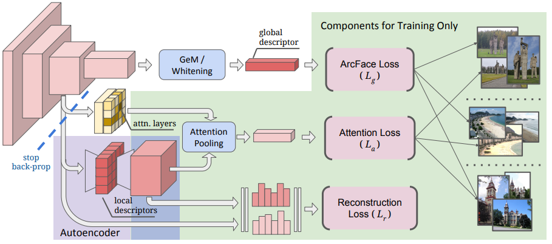

- Unifying Deep Local and Global Features for Image Search #reading 
  heading:: true
	- Zotero Metadata
		- [http://arxiv.org/abs/2001.05027](http://arxiv.org/abs/2001.05027)
		- PDF Attachments
	- [Cao et al_2020_Unifying Deep Local and Global Features for Image Search.pdf](zotero://open-pdf/library/items/2M9WAWWE)
		- [[abstract]]:
			- Image retrieval is the problem of searching an image database for items that are similar to a query image. To address this task, two main types of image representations have been studied: global and local image features.
			- In this work, our key contribution is to unify global and local features into a single deep model, enabling accurate retrieval with efficient feature extraction.
				- We refer to the new model as **DELG**, standing for DEep Local and Global features.
				- We leverage lessons from recent feature learning work and propose a model that combines **generalized mean pooling** [[GeM]]  for global features and **attentive selection** for local features.
				- The entire network can be learned **end-to-end** by carefully balancing the gradient flow between two heads -- requiring only image-level labels.
			- We also introduce an autoencoder-based **dimensionality reduction** technique for local features, which is integrated into the model, improving training efficiency and matching performance.
			- Comprehensive experiments show that our model achieves state-of-the-art image retrieval on the Revisited Oxford and Paris datasets, and state-of-the-art single-model instance-level recognition on the Google Landmarks dataset v2. Code and models are available at https://github.com/tensorflow/models/tree/master/research/delf .
		- zotero items: [Local library](zotero://select/items/1_RGSFBJ7Z)
- Strucuture
  heading:: true
	- {:height 300, :width 749}
	- Global features can be used in the 1st stage of a retrieval system, to efficiently select the most similar images (bottom).
	- Local features can then be empoyed to **re-rank** top results, increasing precision of the system.
- Model
  heading:: true
	- Global features should be similar for images depicting the same object of interest
		- high-level, abstract representations
			- invariant to viewpoint and photometric transformations
	- Local features encode representations that are grounded to specific image regions
		- keypoint detector should be **equivariant** w.r.t viewpoint
		- keypoint descriptor encode localized visual information
	- Hierarchical representations
		- for different types of features
		- deep layers -> high-level cues
		- intermediate layers -> localized information
	- 2 feature maps
		- Shallower $\mathcal{S}\in \mathbb{R}^{H_S\times W_S \times C_S}$
		- Deeper $\mathcal{D}\in \mathbb{R}^{H_D\times W_D \times C_D}$
		- $H_D \leq H_S, W_D \leq W_S, C_D \leq C_S$
			- Deeper layers spatially smaller maps, with a larger number of channels
		- Let $s_{h,w}\in \mathbb{R}^{C_S}$ and $d_{h,w}\in \mathbb{R}^{C_D}$ be features at location $h,w$ in these maps
			- non-negative features (after ReLU)
	- Global features
	  heading:: true
		- [[GeM]]
		- aggregate deep activations into a global feature
	- Local features
	  heading:: true
		- Select only the relevant regions for matching
			- [[attention]] module $M$
				- $\mathcal{A}=M(\mathcal{S})$
				- $M$ is a small CNN
				- $\mathcal{A}\in \mathbb{R}^{H_S\times W_S}$ the attention score map associated to the features from $\mathcal{S}$
		- [[Autoencoder]] module to learn a suitable low-dimensional representation
			- $\mathcal{L}=T(\mathcal{S})$
			- $\mathcal{L}\in \mathbb{R}^{H_S\times W_S \times C_T}$
				- $T$ is the encoding part of AE with a $1\times 1$ CNN layer with $C_T$ filters
			- $\mathcal{L}$ not restricted to non-negative
		- 每个位置上$h,w$上提取的local features are represented with
			- a local descriptor $l_{h,w}\in \mathcal{L}$
			- corresponding keypoint detection score $a_{h,w}\in \mathcal{A}$
- Training
  heading:: true
	- Pipeline
		- 
		- [[softmax]] for [[attention]] learning ($L_a$)
		- [[Autoencoder]] is further trained with a reconstruction loss ($L_r$)
	- 1. a **mean-squared** error regression loss
		- measure how well the autoencoder can reconstruct $\mathcal{S}$
			-
			  $$ L_{r}\left(\mathcal{S}^{\prime}, \mathcal{S}\right)=\frac{1}{H_{S} W_{S} C_{S}} \sum_{h, w}\left\|s_{h, w}^{\prime}-s_{h, w}\right\|^{2} $$
			- $S^{\prime}=T^{\prime}$ as reconstructed version (same dim)
			- $T^{\prime}$ is a $1\times 1$ CNN layer with $C_S$ filters
				- followed by [[ReLU]]
	- 2. a [[cross-entropy]] classification loss that incentivizes the attention module to select discriminative local features
		- 2.1 pool the reconstructed features $\mathcal{S}^{\prime}$ with attention weights $a_{h,w}
			-
			  $$ a^{\prime}=\sum_{h, w} a_{h, w} s_{h, w}^{\prime} $$
		- 2.2 Use a standard softmax-cross-entropy loss
			-
			  $$ L_{a}\left(a^{\prime}, k\right)=-\log \left(\frac{\exp \left(v_{k}^{T} a^{\prime}+b_{k}\right)}{\sum_{n} \exp \left(v_{n}^{T} a^{\prime}+b_{n}\right)}\right) $$
				- $v_i,b_i$ classifier weights and biases for class $i$
				- $k$ index of gt class
			- Tend to make the attention weights large for the discriminative features