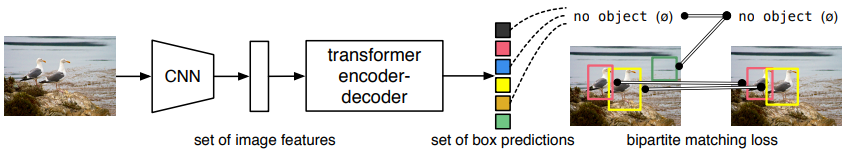
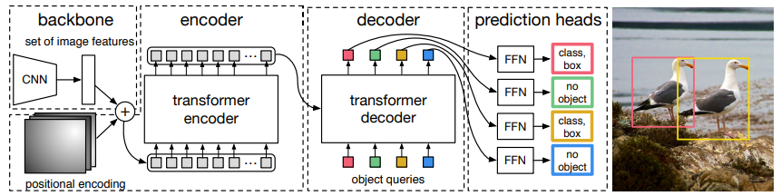
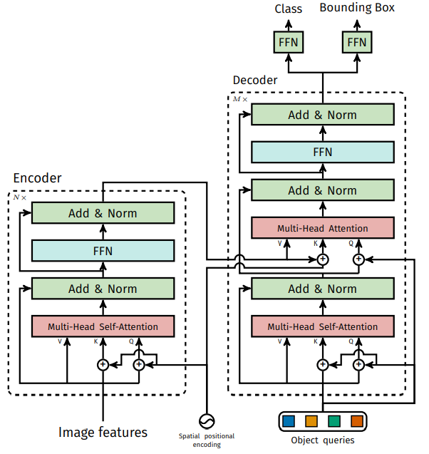

## End-to-End Object Detection with Transformers #readdone
### Zotero Metadata

#### [http://arxiv.org/abs/2005.12872](http://arxiv.org/abs/2005.12872)
#### code: https://github.com/facebookresearch/detr
#### PDF Attachments
	- [Carion et al_2020_End-to-End Object Detection with Transformers.pdf](zotero://open-pdf/library/items/LJKH5VA3)

#### [[abstract]]:
##### We present a new method that views object detection as a **direct set prediction problem**.
##### Our approach streamlines the detection pipeline, effectively removing the need for many hand-designed components that explicitly encode our prior knowledge about the task.
###### 取代现在模型需要手工设计的工作
####### [[NMS]]
####### anchor generation
##### The main ingredients of the new framework, called DEtection TRansformer or DETR, are a ^^set-based global loss^^ that forces unique predictions via [[bipartite graph matching]], and a _transformer encoder-decoder architecture_.
###### Given a fixed small set of learned object queries, DETR reasons about the relations of the objects and the **global image context** to directly output the final set of predictions in parallel.
####### infer固定数量(100)的预测 #practical
###### The new model is conceptually simple and does not require a specialized library, unlike many other modern detectors.
##### DETR demonstrates accuracy and run-time performance on par with the well-established and highly-optimized [[Faster R-CNN]] baseline on the challenging [[COCO]] object detection dataset.
###### Moreover, DETR can be easily generalized to produce panoptic segmentation in a unified manner.
###### We show that it significantly outperforms competitive baselines.
#### zotero items: [Local library](zotero://select/items/1_RJB6MLHT)
## Overview
:PROPERTIES:
:heading: true
:END:
### 两个关键点
#### [[transformer]]的 [[Encoder-decoder]]架构一次性生成$N$个(100)box prediction
#### 设计 [[bipartite graph matching]] loss
##### 基于predicted boxes和gt boxes进行bipartite二分图匹配计算loss
### 
## 1. DETR Architecture
:PROPERTIES:
:heading: true
:END:
### 三个部分: encoder, decoder, FFN
### 
#### CNN backbone to learn a 2D representation.
##### flattened and supplemented with a positional encoding before entering encoder
#### A transformer encoder takes a small fixed number of learned positional embeddings
##### **object queries**
#### pass the output embedding of decoder to a ^^shared^^ [[feed forward network]] (FFN)
##### to predict either a detection or "no object" class
### 1.1 Backbone
#### $\mathbf{x}_{img}\in{\mathbb{R}^{3\times H_0 \times W_0}}$ -> feature map $f\in \mathbb{R}^{C\times H \times W}$
##### $C=2048$
##### $H, W=\frac{H_0}{32}, \frac{W_0}{32}$
### 1.2 encoder
:PROPERTIES:
:heading: true
:END:
#### a $1\times 1$ convolution reduces the channel dim of the high-level activation map $f$
##### $C$ to a smaller dimension $d$
###### 维度压缩
###### new feature map $z_0\in \mathbb{R}^{d\times H \times W}$
##### reshape -> $d\times HW$ feature map
###### 序列化数据
#### each encoder layer has a **multi-head self-attention** module and a [[FFN]]
#### 因为transformer encoder结构是permutation-invariant的 (顺序无关的)
##### 每一个attention layer的输入加上fixed [[positional encoding]]s
###### 反映位置信息
### 1.3 Decoder
:PROPERTIES:
:heading: true
:END:
#### 跟标准transformer区别在于
##### the model decodes the $N$ objects in parallel at each decoder layer
#### 因为transformer decoder结构是permutation-invariant的
##### $N$个input embeddings must be different to produce different results
###### 被成为^^object queries^^
###### 被decoder转换成output embeddings
#### Using self and encoder-decoder attention over these embeddings, the model globally reasons about all objects together using [[Pairwise]] relations between them
##### while able to use the whole image as context
### 1.4 [[FFN]]
### 1.5 Auxiliary decoding losses
:PROPERTIES:
:heading: true
:END:
#### add prediction FFNs and [[Hungarian]] loss after each decoder layer
#### All FFNs share the parameters
#### Use additional shared **layer-norm** to normalize input to the prediction FFNs from different decoder layers
### 
## 2. Loss
:PROPERTIES:
:heading: true
:END:
### 2.1 Object detection set prediction loss to force **unique** matching
:PROPERTIES:
:heading: true
:END:
#### ground truth boxes的个数(即图中object的个数)为$m$，由于$m$是一个事先设定好的远远大于image objects个数的整数，所以$N>>m$即生成的prediction boxes的数量会远远大于ground truth boxes 数量
##### 为了解决上述问题,认为构造一个新的物体类别 $\phi$ 表示没有物体
##### 多出来的$N-m$个prediction embedding就会和 $\phi$类别配对
#### (1) 用 [[Hungarian]] 找到cost最小的 bipartite matching方案
##### search for a permutation of $N$ elements $\sigma \in \mathcal{G}_N$ with the lowest cost
######
$$
\hat{\sigma}=\underset{\sigma \in \mathfrak{S}_{N}}{\arg \min } \sum_{i}^{N} \mathcal{L}_{\operatorname{match}}\left(y_{i}, \hat{y}_{\sigma(i)}\right)
$$
###### $y$ denotes **gt** set of objects (size $N$ padded with $\phi$)
###### $\hat{\mathbf{y}}=\{\hat{y}_i\}^N_{i=1}$ the set of $N$ predictions
###### $\mathcal{L}_{\operatorname{match}}\left(y_{i}, \hat{y}_{\sigma(i)}\right)$ [[Pairwise]] matching cost between **gt** $y_i$ and prediction with index $\sigma(i)$
##### 这个matching cost 考虑class prediction 和 similarity
######
$$
\mathcal{L}_{\operatorname{match}}\left(y_{i}, \hat{y}_{\sigma(i)}\right) = -\mathbf{1}_{\left\{c_{i} \neq \varnothing\right\}} \hat{p}_{\sigma(i)}\left(c_{i}\right)+\mathbf{1}_{\left\{c_{i} \neq \varnothing\right\}} \mathcal{L}_{\mathrm{box}}\left(b_{i}, \hat{b}_{\sigma(i)}\right)
$$
###### $c_i$是target class label (might be $\phi$)
###### $b_i \in \left[0,1\right]^4$是vector to define gt box center coordinates and height, width w.r.t image size
###### $\hat{p}_{\sigma(i)}(c_i)$是probability of class $c_i$
###### $\hat{b}_{\sigma(i)}$是predicted box
##### 重点是找到one-to-one 的匹配,没有duplicates
#### (2) 计算loss function
##### The _Hungarian loss_ for all pairs matched in step (1)
##### 跟常规object detectors类似
###### linear combination of a negative log-likelihood
####### class prediction
####### box loss
######
$$
\mathcal{L}_{\text {Hungarian }}(y, \hat{y})=\sum_{i=1}^{N}\left[-\log \hat{p}_{\hat{\sigma}(i)}\left(c_{i}\right)+\mathbf{1}_{\left\{c_{i} \neq \varnothing\right\}} \mathcal{L}_{\text {box }}\left(b_{i}, \hat{b}_{\hat{\sigma}}(i)\right)\right]
$$
###### $\hat{\sigma}$ optimal assignment in step (1)
###### down-weight the log-probability term when $c_i=\phi$ by factor 10 #practical
####### 解决 class imbalance
####### #related [[Faster R-CNN]] training procedure balances positive/negative by ^^subsampling^^
###### The matching cost between object and $\phi$ does not depend on prediction
####### in this case the cost is constant
##### Bounding box loss
###### make box predictions directly
####### 不同与其他detectors w.r.t. initial guesses
###### 为了解决scale的问题
####### linear **combination** of the [[l1 loss]] and the generalized [[IoU]] loss $\mathcal{L}_{iou}$
######## GIOU is scale-invariant
###### $\mathcal{L}_{box}(b_i, \hat{b}_{\sigma(i)})$ defined as:
#######
$$
\lambda_{\text {iou }} \mathcal{L}_{\text {iou }}\left(b_{i}, \hat{b}_{\sigma(i)}\right)+\lambda_{\mathrm{L} 1}\left\|b_{i}-\hat{b}_{\sigma(i)}\right\|_{1}
$$
######## $\left\|b_{i}-\hat{b}_{\sigma(i)}\right\|$ 为两个box中心坐标的 [[l1 distance]]
######
###
