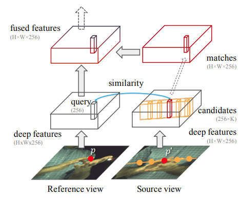
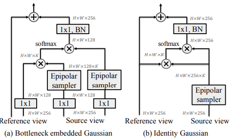
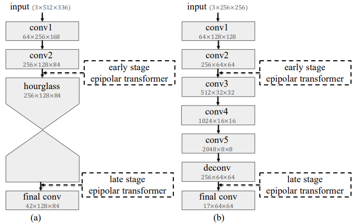

- #readdone
- abstract
	- Common approach to localize 3D human joints (multi-view)
		- 2D detection on each view to localize joints in 2D
		- perform robust [[Triangulation]] on 2D to acquire 3D joint locations
	- Occlusions and oblique viewing angles
		- 最好leverage 3D information
	- propose _differentiable_ **epipolar transformer**
		- like [[stereo matching]]
		- find 2D location $p$ correspondence $p^{\prime}$ in neighboring view
		- combine them to a 3D-aware feature at $p$ (fused)
- Overview
  heading:: true
	- {:height 322, :width 371}
	- enables 2D detectors to leverage 3D-aware features
	- For a query vector (e.g. length 256) on the intermediate deep feature maps of the **reference **view ($H\times W \times 256$), extract $K$ samples along the corresponding [[epipolar line]]  in the **source **view
	- Dot-product and [[softmax]] used to compute similarity between query and sampled vectors
		- in turn used to compute the corresponding feature
	- Fused with reference view feature to arrive at a 3D-aware feature for reference view
- 1. Epipolar Sampler
  heading:: true
	- Given two images captured at the same time but from 2 different views
		- **reference view** $\mathcal{I}$ and **source view** $\mathcal{I}^{\prime}$
			- Their projection matrices as $M, M^{\prime}\in \mathbb{R}^{3\times 4}$
			- camera centers as $C,C^{\prime} \in \mathbb{R}^4$ in homogeneous coordinates
			- epipolar line $l$
				- given query pixel $p=(x,y,1)$ in $\mathcal{I}$
				- $l=[M^{\prime}C]_{\times} M^{\prime}M^{+}p$
					- $M^{+}$ is the [[pseudo-inverse]] of $M$
					- $p,p^{\prime}$ on the epipolar line $l^{\top}p^{\prime}=0$
		- sample features along the corresponding epipolar line in the source view
			- #practical  $K=64$
			- along the visible portion of the epipolar line (intersection of $\mathcal{I}^{\prime})$
			- form a set $\mathcal{P}^{\prime}$
				- sub-pixel locations via [[bilinear interpolation]]
			- skip the query points whose epipolar lines don't intersect with $\mathcal{I}^{\prime}$
- 2. Feature Fusion Module
	- If we know GT $p^{\prime}$ in the source view
		- corresponds to $p$ in reference view
	- However GT unknown
		- approximate $F_{src}(p^{\prime})$ by a weighted sum of all the features along the epipolar line
		-
		  $$\bar{F}_{src}(P) = \sum\limits_{p^{\prime}\in \mathcal{P}^{\prime}} \rm{sim}(p,p^{\prime})F_{src}(p^{\prime})$$
			- $\rm{sim}$ here is dot-product followed by a softmax
	- Then fuse it with $F_{ref}(p)$
		-
		  $$F_{fused}(p) = F_{ref}(p) + W_z (\bar{F}_{src}(p))$$
			- The weights $W_z$ are $1\times 1$ convolutions
	- Structure #kanban
		- ^^Identity Gaussian^^ architecture
		- ^^Bottleneck Embedded Gaussian^^ architecture
	- 
		- the channel size is downsampled by 2
		- output is up-sampled back
			- the shape of the fused features still matches the input's shape
- 3. Insertion of Epipolar Transformer
  heading:: true
	- 
		- Early stage or late stage where we can add epipolar transformer to the backbone model.
			- (a) [[Hourglass networks]]
			- (b) [[ResNet 50]] detector
		-