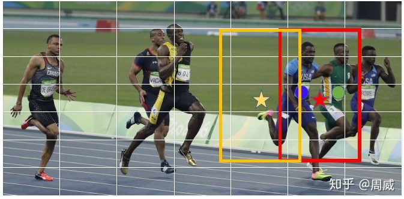
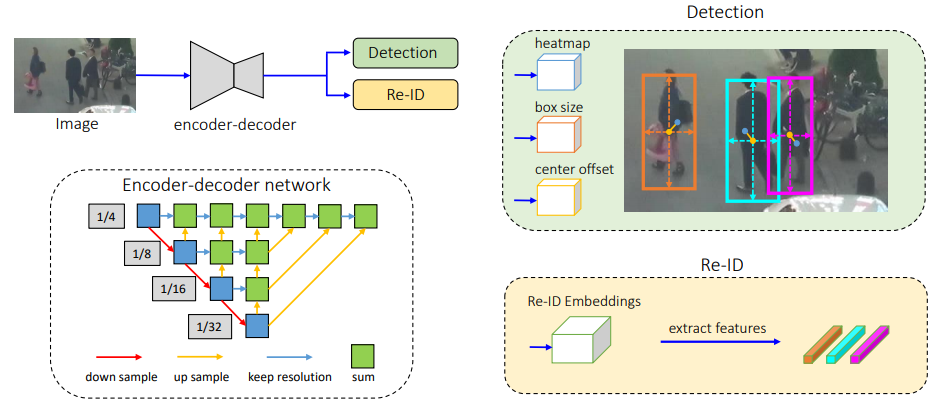

- FairMOT: On the Fairness of Detection and Re-Identification in Multiple Object Tracking #readdone
	- Zotero Metadata
		- [http://arxiv.org/abs/2004.01888](http://arxiv.org/abs/2004.01888)
		- [[abstract]]:
			- There has been remarkable progress on object detection and re-identification (re-ID) in recent years which are the key components of multi-object tracking.
				- Little attention has been focused on jointly accomplishing the two tasks in a single network.
			- Our study shows that the previous attempts ended up with _degraded_ accuracy mainly because the re-ID task is not fairly learned which causes many identity switches.
			- The **unfairness** lies in two-fold:
				- (1) they treat re-ID as a secondary task whose accuracy heavily depends on the primary detection task. So training is largely biased to the detection task but ignores the re-ID task
				- (2) they use [[ROI]] align to extract re-ID features which is directly borrowed from object detection.
				- However, this introduces a lot of **ambiguity** in characterizing objects because many sampling points may belong to disturbing instances or background.
			- To solve the problems, we present a simple approach **FairMOT** which consists of two homogeneous branches to predict pixel-wise objectness scores and re-ID features.
			- The achieved fairness between the tasks allows **FairMOT** to obtain high levels of detection and tracking accuracy and outperform previous state-of-the-arts by a large margin on several public datasets.
			- The #code and pre-trained models are released at https://github.com/ifzhang/FairMOT.
		- zotero items: [Local library](zotero://select/items/1_LYIWPJ4B)
		- code:  https://github.com/ifzhang/FairMOT
- 3 Unfairness of [[JDE]]
  heading:: true
	- [[JDE]]使用anchor based detector的缺陷
		- 一个object可能被多个anchor负责并检测
			- 导致严重的ambiguities for the network
		- 实际物体的中心可能与负责对该object进行检测的anchor center有偏差
		- {:height 195, :width 372}
	- 多层信息融合很重要
		- [[DLA]] ->  multi-layer fusion
		- [[Re-ID]] 应该包括语义信息的同时,包括低层网络中的颜色,纹理信息
	- Feautre Dimension
		- Lower-dimensional features is better for [[single-shot]] [[MOT]] for 3 reasons
			- 1) 高维re-ID features虽然会提高一些differentiate objects的能力,但是会损害object detection accuracy
				- conflict of two tasks
			- 2) when training data is small, 不会over-fitting
			- 3) low-dim speedy
- 0. Strucuture
  heading:: true
	- 
	- 两个head branch,每个由$3\times 3$ conv layer 后面接一个 $1\times 1$ conv layer
- 1. Backbone Network
  heading:: true
	- [[DLA]]-34
	-
- 2. Detection Branch
  heading:: true
	- Similar to [[centernet]]
- 3. Re-ID Branch
  heading:: true
	- generate features to distinguish objects
	- affinity among different object should be smaller than that between same objects
	- 128 kernels on top of backbone features to extract re-ID features for each location
		- resulting feature map as $\mathbf{E} \in \mathbb{R}^{128\times W\times H}$
			- $\mathbf{E}_{x,y}\in \mathbb{R}^{128}$ of an object centered at $(x,y)$
	- Re-ID Loss
	  heading:: true
		- learn from a classification task
		- For each gt box $\mathbf{b}^i=(x_1^i,y_1^i,x_2^i,y_2^i)$ in image
			- get object center on the heatmap $(\tilde{c}_x^i,\tilde{c}_y^i)$
		- Extract the re-ID feature vector $\mathbf{E}_{\tilde{c}_x^i,\tilde{c}_y^i}$
		- Learn to map it to a **class distribution** vector $\mathbf{P}=\{\mathbf{p}(k), k\in [1,K]\}$
			- $\mathbf{p}(k)$为第$k$个物体的预测class (ID编号) probability distribution
		- Define re-ID loss
			-
			  $$L_{\rm{identity}}=-\sum\limits_{i=1}^{N}\sum\limits_{k=1}^{K} \mathbf{L}^i(k) \log (\mathbf{p}(k))$$
				- [[one-hot]] representation of the **gt** class label as $\mathbf{L}^i(k)$
				- $K$ num of classes
- 4. Training
	-
- 5. Online Inference
	-