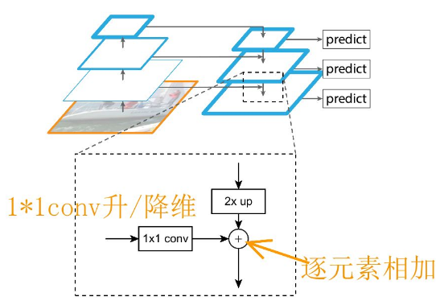

- #reference  Feature Pyramid Networks for [[object detection]]
- 传统的图像金字塔Image Pyramid
    - 
    - 这个过程中,每个特征提取/预测都是独立进行的,模型之间很难共享它们中间提取的特种
    - 所以[[SSD]]在不同分辨率的特征上直接预测
        - 但是底层语义特征不够,有效信息太少
        - 最高分辨率不高
- Detect multi-scale 2D box in different pyramid layers
    - 每个layer都包含不同内核大小的卷积滤波器,以扩大 [[receptive field]]并集成更多有用的信息
- pyramid of [[feature map]]s
    - {:height 228, :width 273}
    - feature maps closer to the image layer (low level structures) are not effective for accurate object detection
- FPN does not use feature extractor of detectors like [[Faster R-CNN]]
    - generates multiple [[feature map]] layers (multi-scale feature maps)
    - 自顶向下路径和横向连接将低分辨率,语义强的特性与高分辨率,语义弱的特征结合
    - 
    - 有两个pathway
        - bottom-up -> feature extraction
            - -> decrease spatial resolution -> higher level -> higher semantic value
        - top-down -> higher resolution reconstructed layers -> better localization
            - upsample
                - 最近邻插值
    - Lateral connections between reconstructed layers and corresponding feature maps
        - also act as [[skip connection]]s to make training easier (like [[ResNet]])
        - {:height 329, :width 462}
        - 这个跳接skip connection融合特征之后,还要进行一个$3\times 3$ convolution
            - 减轻最近邻插值带来的影响
- 一篇paper[[DyFPN]]指出并非所有对象都需要复杂的计算模块
-