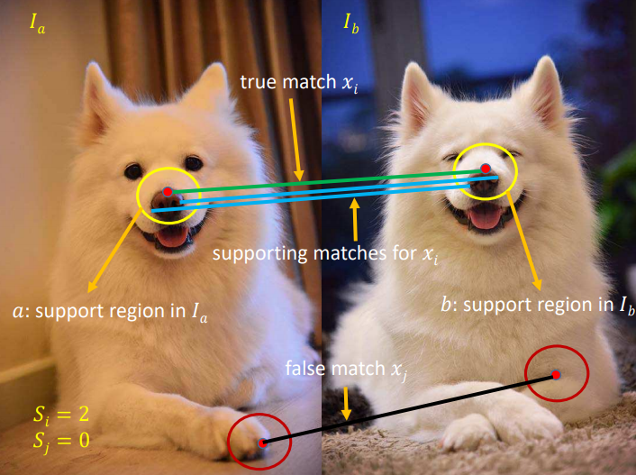

- GMS: Grid-based Motion Statistics for Fast, Ultra-Robust Feature Correspondence #reading
        - PDF Attachments
    - [Bian et al. - GMS Grid-based Motion Statistics for Fast, Ultra-.pdf](zotero://open-pdf/library/items/MZ3UZSX9)
        - [[abstract]]:
            - Incorporating smoothness constraints into feature matching is known to enable ultra-robust matching. However, such formulations are both complex and slow, making them unsuitable for video applications.
            - This paper proposes GMS (**Grid-based Motion Statistics**), a simple means of encapsulating motion smoothness as the ^^statistical likelihood^^ of a certain number of matches in a region.
            - GMS enables translation of high match numbers into high match quality.
                - This provides a real-time, ultra-robust correspondence system.
        - zotero items: [Local library](zotero://select/items/1_LZ8P57T2)
- 1. Idea
  heading:: true
    - Input: A pair of images input from different views of the same 3D scene
    - If the motion is smooth
        - neighboring pixels and features move together
    - 
    - Assumption 1
      heading:: true
        -
          #+BEGIN_QUOTE
          Motion smoothness causes a (small) neighborhood around a true match to view the same 3D location.
          Likewise, the neighborhood around a false match views geometrically different 3D locations.
          #+END_QUOTE
        - neighborhood here is a pair of regions $\{a,b\}$ surrounding the respective image features
        - So true match neighborhoods view the same 3D region
            - share many similar features across images
                - -> many **supporting matches**
            - 相比来说,false match neighborhoods (viewing different 3D reigons) 拥有更少的similar features
                - -> few supporting matches
        - Encapsulate it into a statistic framework
            - To distinguish true and false matches
- 2. Statistical Constraints
  heading:: true
    - 2.1 Notation
        - Image pairs $\{I_a, I_b\}$ have $\{N,M\}$  features respectively
            - $\mathcal{X}=\{x_1,x_2,\cdots, x_i, \cdots, x_N\}$  is the set of all nearest neighbor feature matches from $I_a$ to $I_b$
            - $\mathcal{X}$ has cardinality $|\mathcal{X}|=N$
            - Goal is to divide $\mathcal{X}$ into sets of true and false matches by analyzing the local support of each match.
        - $\mathcal{X}_i \subseteq \mathcal{X}$ is the subset of matches between regions $\{a,b\}$ of match $x_i$.
        - $S_i$ is a measure of neighborhood support
            -
              $$S_i=|\mathcal{X}_i|-1$$
            - $-1$ removes the original match
    - 2.2 Statistical constraints
        - Assumption 2
            -
              #+BEGIN_QUOTE
              Give $f_a$ matches wrongly, its nearest neighbor match can lie in any of the $M$ possible locations
              #+END_QUOTE
            - TODO finish the reasoning here
              todo:: 1614927488491
    - 2.3 Multi-neighborhood Generalization
        - Assumption 3
            -
              #+BEGIN_QUOTE
              If motion is smooth over a region, a true match allows prediction of multiple small region pairs that view the same 3D location.  Using the same prediction function on a false match will result in geometrically different 3D locations.
              #+END_QUOTE
            -