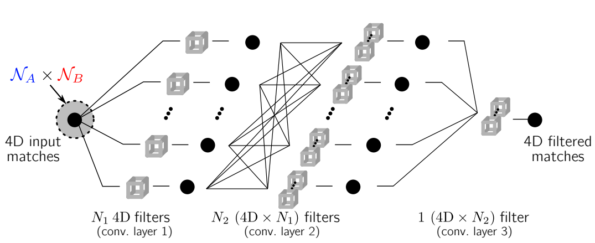

- #title  Neighbourhood Consensus Networks #reading
        - #url:  [http://arxiv.org/abs/1810.10510](http://arxiv.org/abs/1810.10510)
        - PDF Attachments
            - [Rocco et al_2018_Neighbourhood Consensus Networks.pdf](zotero://open-pdf/library/items/J72HEHWK)
        - zotero items: [Local library](zotero://select/items/1_Q75RVNY3)
        - [[abstract]]
            - We address the problem of finding reliable **dense correspondences** between a pair of images.
                - This is a challenging task due to strong appearance differences between the corresponding scene elements and ambiguities generated by **repetitive patterns**.
            - The contributions of this work are threefold. #numlist
                - Inspired by the classic idea of disambiguating feature matches using **semi-local constraints**, we develop an end-to-end trainable convolutional neural network architecture that
                    - identifies sets of spatially consistent matches by analyzing neighbourhood consensus patterns in the 4D space of all possible correspondences between a pair of images
                    - without the need for a global geometric model.
                - We demonstrate that the model can be trained effectively from weak supervision in the form of matching and non-matching image pairs without the need for costly manual annotation of point to point correspondences.
                - We show the proposed **neighbourhood consensus network** can be applied to a range of matching tasks including both **category- and instance-level matching**
- 
- Strucutures #numlist
  heading:: true
    - Dense feature extraction and matching
        - Classic hand-crafted method selecting a match is not differentiable
        - Given 2 sets of dense feature descriptors $f^A=\{f_{ij}^A\}$ and $f^B=\{f_{ij}^B\}$
            - exhaustive pariwise [[Cosine Similarity]]  computed and stored in a **4D** tensor $c\in  \mathbb{R}^{h\times w\times h \times w}$
                - referred to as **correlation map**
                    - score all pairwise matches
                -
                  $$c_{ijkl}=\frac{<f_{ij}^A,f_{kl}^B>}{||f_{ij}^A||_2 ||f_{kl}^B||_2}$$
                - local neighbourhoods $\mathcal{N}_A$ and $\mathcal{N}_B$
    - neighbourhood consensus network
      heading:: true
        - propose a 4D CNN for the neighbourhood consensus task $N(\cdot)$
        - 目的是suppress and amplify matches based on supporting evidence in neighborhoods
            - semi-local level
        - {:height 263, :width 623}
            - NC-Net
            - 1st layer filters span $\mathcal{N}_A \times \mathcal{N}_B$
                - the Cartesian product of local neighbourhoods
            - Proposed 4D neighbourhood consensus CNN learn to identify the matching patterns of reliable and unreliable matches
        - 尽管number of correct matches order of $hw$, smaller than size of correlation map $(hw)^2$
            - we expect correct matches to have a coherent set of supporting matches surrounding them in the 4D space
            - The geometric patterns are **equivariant** with translations in the input images
                - image平移了，matching pattern also translated in the 4D space by equal amount
            - 第一层
                - $N_1$ filters to learn different local geometric deformations
                - $N_1$ output channels
            - To be invariant to particular order of input images 输入顺序无关
                - Propose to apply the network **twice**
                    -
                      $$\tilde{c}=N(c)+\left(N(c^{\top})\right)^{\top}$$
                    - $c^{\top}$ swap the pair of dimensions corresponding to the 1st and 2nd images
                        - $(c^{\top})_{ijkl}=c_{kljk}$
                        - matches with inconsistent local patterns downweighted or removed
    - soft mutual nearest neighbour filter
        -
    - extraction of correspondences from the output 4D filtered match tensor
    - [[weakly supervised]]  training loss