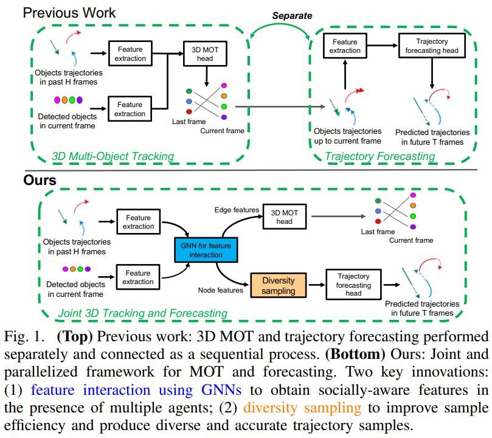

## Parallelized 3D Tracking and Forecasting with Graph Neural Networks and Diversity Sampling #toread
### Zotero Metadata

#### PDF Attachments
	- [Weng et al. - Parallelized 3D Tracking and Forecasting with Grap.pdf](zotero://open-pdf/library/items/7X2SYIC6)

#### [[abstract]]:
##### Multi-object tracking (MOT) and trajectory forecasting are two critical components that require accurate modeling of **multi-agent interaction**.
###### We hypothesize that it is beneficial to unify both tasks under one framework in order to learn a _shared feature representation_ of agent interaction.
###### Furthermore, instead of performing tracking and forecasting sequentially which can _propagate errors from tracking to forecasting_, we propose a parallelized framework to mitigate the issue.
##### Also, our proposed parallel track-forecast framework incorporates two additional novel computational units.
###### 1. employ a **feature interaction** technique by introducing [[GNN]]s to capture the way in which agents interact with one another.
####### The GNN is able to improve _discriminative feature learning_ for MOT association and provide _socially-aware contexts_ for trajectory forecasting.
###### 2. use a **diversity sampling function** to improve the quality and diversity of our forecasted trajectories.
####### The learned sampling function is trained to
######## efficiently extract a variety of outcomes from a generative trajectory distribution
######## helps avoid the problem of generating duplicate trajectory samples.
##### We evaluate on [[KITTI]] and [[nuScenes]] datasets showing that our method with socially-aware feature learning and diversity sampling achieves new state-of-the-art performance on both 3D MOT and trajectory forecasting.
#### zotero items: [Local library](zotero://select/items/1_YICQ8PIG)
## Introduction
:PROPERTIES:
:heading: true
:END:
### 1. Trajectory set
#### Let $\mathcal{O}=\{\mathbf{o}_1,\cdots, \mathbf{o}_M\}$ denote the set of past trajectories of $M$ tracked objects
#### Each trajectory $\mathbf{o}_i=\left[\mathbf{o}_i^{-H}, \cdots, \mathbf{o}_i^{-1}\right]$ 包括associated detections of the $i$-th tracked object in the past $H$ frames
##### 其中 associated detection at frame $t\in{\{-H, \cdots, -1\}}$是一个tuple $\mathbf{o}_i^t=\left[x,y,z,l,w,h,\theta,I \right]$
###### $I$是assigned ID
### 2. Detection set
#### Let $\mathcal{D}=\{\mathbf{d}_1, \cdots, \mathbf{d}_N\}$ denote the set of **unassociated** 3D detections of $N$ objects in the current frame
#### Each unassociated detection $\mathbf{d}_j=\left[x,y,z,l,w,h,\theta\right]$
##### without the assigned ID $I$,因为还没match
### 3. Goal of [[MOT]] and [[3d track]]
#### Associate current detection $\mathbf{d}_j \in{\mathcal{D}}$ with the past object trajecotry $\mathbf{o}_i \in \mathcal{O}$
#### Assign an ID to $\mathbf{d}_j$
### 4. Goal of trajectory forecasting
#### Predict the future trajectories $\mathcal{F}=\{\mathbf{f}_i, \cdots,\mathbf{f}_M\}$ for all $M$ tracked objects in the past
##### Each future trajectory $\mathbf{f}_i=\left[\mathbf{f}_i^1, \cdots, \mathbf{f}_i^T \right]$ consists of $x,z$ positions
##### bird's eye view / top-down view of the $i$-th object in future $T$ frames
### 
#### (1) feature extractor
##### encode the feature for the object trajectories in the past and current detections
#### (2) feature interaction using [[GNN]]s
##### update the object features based on the features of **other objects**
#### (3) 3D MOT head
##### ((6029fa64-d023-47c5-a420-85c67862492a))
#### (4) trajectory forecasting head
##### learns a [[CVAE]] to generate future trajectories
###### based on the GNN features and past trajectories
#### (5) diversity sampling
##### to optimize the diversity of the trajectory samples
## 
## 1. Feature extraction
:PROPERTIES:
:heading: true
:END:
### Get the feature by applying a two-layer [[LSTM]]
#### to model the temporal dynamics in the data and outputs a feature $\mathbf{u}_i$ with 64 dims
### For a detected object $j$ in the current frame, use a [[MLP]] to map $\mathbf{d}_j$ to a 64-dim feature $\mathbf{v}_j$
### They are used as initial node features $\mathbf{u}_i^0$ and $\mathbf{v}_j^0$ at layer 0 of the GNNs for 2nd step interaction
### The extractor is shared for both tracking and forecasting
## 2. Graph Neural Network for Feature Interaction
:PROPERTIES:
:heading: true
:END:
### 2.1 Graph Construction
:PROPERTIES:
:heading: true
:END:
#### $M$ features $\{\mathbf{u}_1^0, \cdots, \mathbf{u}_M^0\}$ for tracked objects in the past
#### $N$ features $\{\mathbf{v}_1^0, \cdots, \mathbf{v}_N^0\}$ for detected objects in current frame
#### Construct an $L$-layer _undirected_ GNN
##### each layer includes nodes of the $M$ tracked objects and $N$ detected objects
##### **undirected** here because the interaction should be _mutual_
#### For each layer $l$, denote the node feautures $\mathcal{U}^l$ and $\mathcal{V}^l$
##### node feature updated at each layer
#### Edge connection - sparse, dynamic
##### prior knowledge
###### interactions 只发生在临近的objects
###### two nodes' box centers have distance less than $C$ meters in 3D space
##### edge connection 是动态的
###### GNNs can model interactions in different scenes with varying objects
###### 尽管 edge connections are fixed across layers of GNNs at the same time step
### 2.2 Node Feature Aggregation
:PROPERTIES:
:heading: true
:END:
#### Based on [[GraphConv]]
#####
$$\mathbf{u}_i^{l+1}=\sigma_1^l(\mathbf{u}_i^l) + \sum\limits_{j\in{\mathcal{N}(i)}}\sigma_2^l(\mathbf{v}_j^l) + \sum\limits_{g\in{\mathcal{N}(i)}}\sigma_3^l(\mathbf{u}_g^l)$$
###### $\mathbf{u}_i^l$ and $\mathbf{u}_i^{l+1}$ are the node features for a tracked object $i$ at layer $l$ and $l+1$.
###### $\mathcal{N}(i)$ denote a set of neighborhood nodes
####### connected to the node $i$ by an edge
###### $\sigma_1^l$ linear layer weights, [[ReLU]] applied after each layer aggregation
#### 除了update the node feature for tracked objects, 还有detected objects
#####
$$\mathbf{v}_j^{l+1}=\sigma_1^l(\mathbf{v}_j^l) + \sum\limits_{j\in{\mathcal{N}(j)}}\sigma_2^l(\mathbf{u}_i^l) + \sum\limits_{g\in{\mathcal{N}(j)}}\sigma_3^l(\mathbf{v}_g^l)$$
##### updated node features for tracked objects and detected objects will **affect each** other via feature interaction in the following layers
#### Finally we use the node features at the final layer $L$ for tracked objects $\mathcal{U}^L$ as inputs to our forecasting head
##### have enough information from both trajectories and current detections
### 2.3 Edge Feature
:PROPERTIES:
:heading: true
:END:
#### Use affinity matrix to represent similarity
##### edge feature 定义为相连的node features之间的差别
######
$$\mathbf{e}_{ij}^{l}=\mathbf{u}_i^l - \mathbf{v}_j^l$$
###### Two features $\mathbf{u}_i^l$ and $\mathbf{v}_j^l$ are related at layer $l$
##### Use the set of edge features $\mathcal{E}^L$ at the final GNN layer as inputs to 3D MOT head for data association
## 3. 3D Multi-Object Tracking Head
:PROPERTIES:
:heading: true
:END:
### learn an affinity matrix $A$ based on pairwise similarity of the features $M\times N$
#### extracted from $M$ tracked objects (past)
#### and $N$ detected objects (current frame)
#### each entry $A_{ij}$ is the similarity score between tracked object $i$ and detected object $j$
### 3.1 Edge Regression
:PROPERTIES:
:heading: true
:END:
#### use an edge feature $\mathbf{e}_{ij}^L$ as input
#### {:height 194, :width 455}
#### output a scalar value between 0 and 1
#####
$$A_{ij}=\rm{Sigmoid}\left(\sigma_4(\rm{ReLU}(\sigma_3(\mathbf{e}_{ij}^L)))\right)$$
###### $\sigma_3$ and $\sigma_4$ are 2 linear layers
##### ((6029fa64-6cc9-44f0-acfc-9dcaf2b99b54))
##### For objects that cannot be associated, employ the birth and death memory
###### #related [[3D multi-object tracking by Weng Xinshuo]]
##### During training, compute the [[affinity loss]] between the estimated affinity matrix $A$ and GT.
### 3.2 Affinity Loss
:PROPERTIES:
:heading: true
:END:
#### $\mathcal{L}_{aff}$ directly supervises the output $A$ of 3D MOT head
##### 1) Formulate the prediction of the **affinity matrix** as a ^^binary classification^^ problem
###### Use the [[binary cross entropy]] loss $\mathcal{L}_{bce}$ to apply on each entry
#######
$$
\mathcal{L}_{\text {bce }}=\frac{-1}{M N} \sum_{i=1}^{M} \sum_{j=1}^{N} A_{i j}^{g} \log A_{i j}+\left(1-A_{i j}^{g}\right) \log \left(1-A_{i j}\right)
$$
##### 2) Each row and column of the $A^g$  (gt) can only be a [[one-hot]] vector or an all-zero vector
###### 每个tracked object $\mathbf{o}_i$ 只有一个matched detection $\mathbf{d}_j$或干脆没有
###### Set of rows and columns in $A^g$ one-hot vector $\mathcal{M}_{oh}$, $\mathcal{N}_{oh}$
####### apply [[cross-entropy]] $\mathcal{L}_{ce}$ to them
######## $j$th column $A^g_{\cdot j}$ in GT affinity matrix is a one-hot vector
######## the loss $\mathcal{L}_{ce}$ for $j$th column is
#########
$$
\mathcal{L}_{\mathrm{ce}}^{\cdot j}=-\frac{1}{M} \sum_{i=1}^{M} A_{i j}^{g} \log \left(\frac{\exp A_{i j}}{\sum_{i=1}^{M} \exp A_{i j}}\right)
$$
###### So the [[affinity loss]] $\mathcal{L}_{aff}$ for 3D MOT
####### $\mathcal{L}_{\mathrm{aff}}=\mathcal{L}_{\mathrm{bce}}+\mathcal{L}_{\mathrm{ce}}=\mathcal{L}_{\mathrm{bce}}+\sum_{i \in \mathcal{M}_{o h}} \mathcal{L}_{\mathrm{ce}}^{i .}+\sum_{j \in \mathcal{N}_{o h}} \mathcal{L}_{\mathrm{ce}}^{j}$
######## same weight of 1
## 4. Trajectory Forecasting Head
### Conditional [[generative]] model $p_{\theta}(\mathbf{f}_i | \mathbf{o}_i, \mathbf{u}_i^L)$
#### learn the distribution of the $i$th tracked object's future trajectory $\mathbf{f}_i$
#### based on past trajectory and node feature at last GNN layer
###
#+BEGIN_NOTE
trajectory forecasting head 不直接依赖于MOT association results in current frame,而是用feature interaction之后的node feature $\mathbf{u}^L_i$
#+END_NOTE
#### 防止当前frame的association error by MOT 造成deteriorate
#### 而且node feature $\mathbf{u}_i^L$本身就encode object information via _interaction_
### 使用[[CVAE]]作为generative model
#### latent variable $z$ to
##### model unobserved factors
###### like agent intentions
##### capture the multi-modal distribution of the future trajectory $\mathbf{f}$
#### variational lower bound $\mathcal{V}_{lb}(\mathbf{f}; \theta, \phi)$ of the log-likelihood function $\log p_{\theta}(\mathbf{f|o,u})
#####
$$
\begin{aligned}
\mathcal{V}_{l b}(\boldsymbol{f} ; \theta, \phi)=&\left.\mathbb{E}_{q_{\phi}(\boldsymbol{z} \mid \boldsymbol{f}, \boldsymbol{o}, \boldsymbol{u})}\left[\log p_{\theta}(\boldsymbol{f} \mid \boldsymbol{z}, \boldsymbol{o}, \boldsymbol{u})\right)\right] \\
&-\operatorname{KL}\left(q_{\phi}(\boldsymbol{z} \mid \boldsymbol{f}, \boldsymbol{o}, \boldsymbol{u}) \| p(\boldsymbol{z})\right)
\end{aligned}
$$
###### where $p(z)=\mathcal{N}(0, \mathbf(I))$ is a Gaussian latent prior
###### $q_{\phi}(z|\mathbf{f,o,u})=\mathcal{N}(\mathbf{\mu}, \rm{Diag}(\sigma^2))$ is an approximated posterior (**encoder distribution**)
###### $p_{\theta}(\mathbf{f|z,o,u})=\mathcal{N}(\tilde{\mathbf{f}},\alpha\mathbf{I})$ is a conditional likelihood (**decoder distribution**)
##### Use 2 [[RNN]]s as the encoder $F_{\phi}$ and decoder $G_{\theta}$
######
$$(\mu, \sigma)=F_{\phi}(\mathbf{f,o,u})$$
######
$$\tilde{\mathbf{f}}=G_{\theta}(\mathbf{z,o,u})$$
#### So $\mathcal{L}_{cvae}=-\mathcal{V}_{lb}$
### Overall loss $\mathcal{L}_{total}=\mathcal{L}_{aff} + \mathcal{L}_{cvae} = \mathcal{L}_{aff}- \mathcal{L}_{lb}$
### Once the CVAE model is learned, can produce the $i$-th agent's future trajectories $\mathbf{f}_i$ by randomly sampling a set of latent codes $\{\mathbf{z}_{i1}, \cdots, \mathbf{z}_{iK}\}$ from the latent prior
#### and decode them using the decoder $G_{\theta}$ into future trajectory samples $\{\mathbf{f}_{i1}, \cdots, \mathbf{f}_{iK}\}$
#### 为了样本多样性,提出diversity sample technique
## 5. Diversity Sampling technique
###
