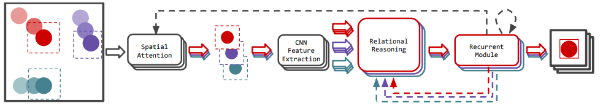
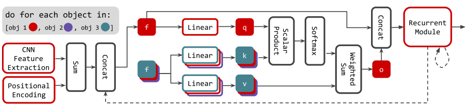

- End-to-end Recurrent Multi-Object Tracking and Trajectory Prediction with Relational Reasoning #toread
    - Zotero Metadata
        - [http://arxiv.org/abs/1907.12887](http://arxiv.org/abs/1907.12887)
        - PDF Attachments
    - [Fuchs et al. - 2020 - End-to-end Recurrent Multi-Object Tracking and Tra.pdf](zotero://open-pdf/library/items/74TT56V7)
        - [[abstract]]:
            - The majority of contemporary object-tracking approaches do not model interactions between objects. This contrasts with the fact that objects’ paths are not independent: a cyclist might abruptly deviate from a previously planned trajectory in order to avoid colliding with a car.
            - Building upon HART, a neural class-agnostic single-object tracker, we introduce a multi-object tracking method (**MOHART**) capable of relational reasoning. Importantly, the entire system, including the understanding of interactions and relations between objects, is class-agnostic and learned simultaneously in an end-to-end fashion. We explore a number of relational reasoning architectures and show that permutation-invariant models outperform non-permutation-invariant alternatives. We also find that architectures using a single permutation invariant operation like DeepSets, despite, in theory, being universal function approximators, are nonetheless outperformed by a more complex architecture based on multi-headed attention. The latter better accounts for complex physical interactions in a challenging toy experiment. Further, we find that modelling interactions leads to consistent performance gains in tracking as well as future trajectory prediction on three real-world datasets (MOTChallenge, UADETRAC, and Stanford Drone dataset), particularly in the presence of ego-motion, occlusions, crowded scenes, and faulty sensor inputs.
        - zotero items: [Local library](zotero://select/items/1_FJWNWF5T)
- [[relational reasoning]]
    - is the ability to model interactions and relations between objects.
        - to access a list of object representations
        - order is not that important #related  [[permutation invariance]]
    -
- Strucuture
    - 
    - Hierarchical attentive recurrent tracking (MOHART) is built upon [[HART]]
        - Extend to multiple object modality
        -
    - Relational reasoning
    - 
    -