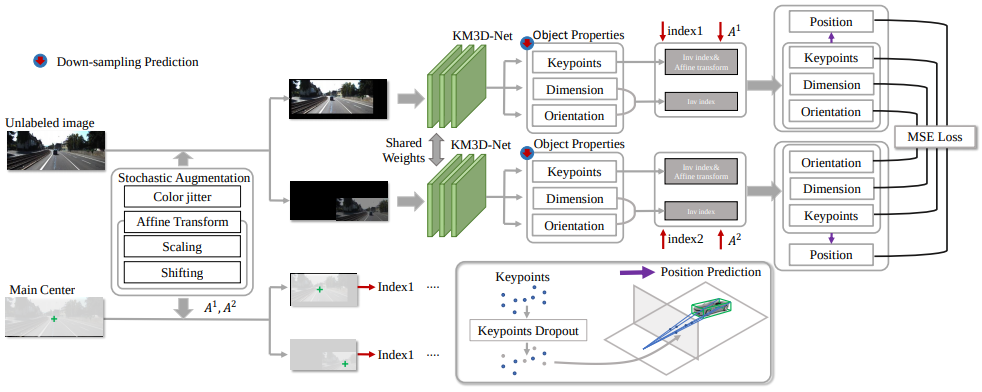

## Monocular 3D Detection with Geometric Constraints Embedding and Semi-supervised Training #toread
### Zotero Metadata
#### [http://arxiv.org/abs/2009.00764](http://arxiv.org/abs/2009.00764)
#### Cite key: liMonocular3DDetection2020
#### PDF Attachments
	- [Li_2020_Monocular 3D Detection with Geometric Constraints Embedding and Semi-supervised.pdf](zotero://open-pdf/library/items/V4WX3BIL)

#### zotero items: [Local library](zotero://select/items/1_NJDIR2WJ)
#### [[abstract]]:
##### In short:  **KM3D**-Net, based on [[RTM3D]].
##### 简介
###### A fully convolutional model to predict object keypoints, dimension, and orientation, and then combine these estimations with ^^perspective geometry^^ constraints to compute position attribute.
###### Further, reformulate the geometric constraints as a _differentiable_ version and embed it into the network to reduce running time while maintaining the consistency of model outputs in an _end-to-end fashion_.
###### Our model only requires RGB images without synthetic data, instance segmentation, CAD model, or depth generator.
####### 不需要depth prediction
##### 网络结构
###### Benefiting from this simple structure, propose an effective [[semi-supervised]] training strategy for the setting where labeled training data is scarce.
####### Geometry Reasoning Module
###### In this strategy, we enforce a **consensus prediction** of two _shared-weights_ KM3D-Net for the same unlabeled image, but different:
######## Data augmentation
######### we unify the coordinate-dependent augmentations as the affine transformation for the differential recovering position of objects
######## Network regularization
######### propose a **keypoints-dropout** module for the network regularization.
########## 用2个keypoints就可以recover 3D bbox.
########## 用4个Keypoints没有明显改进
##### 结果
###### extensive experiments on the popular KITTI 3D detection dataset indicate that the KM3D-Net surpasses all previous state-of-the-art methods in both efficiency and accuracy by a large margin.
###### And also, to the best of our knowledge, this is the first time that semi-supervised learning is applied in monocular 3D objects detection.
###### We even surpass most of the previous fully supervised methods with only 13% labeled data on KITTI.
## {:height 547, :width 775}
## Structure of detection heads
:PROPERTIES:
:heading: true
:END:
### 1. Main Center
#### ((601bc1fd-63f7-4414-9ba1-46d0bc745a5e))
##### $C$ is the object categories
### 2. Keypoints (9 ordered 2D perspective keypoints)
#### 8个vertexes和1个中心点的
#### They are geometrically and semantically consistent across differen
##### ((601bc1fd-5096-4749-b664-129aca28bc13))
### 3. Dimension
#### regress the residual value $\delta_D \in R^{\frac{h}{4}\times \frac{w}{4}\times 3}$ to restore object dimension by
##### $\bar{H}e^{\sigma_H}, \bar{W}e^{\sigma_W}, \bar{L}e^{\sigma_L}$ following [[disentangling transformation]]
##### statistical average in [[KITTI]]: $\bar{H}=1.63, \bar{W}=1.53, \bar{L}=3.88$
### 4. Orientation
#### reress the local orientation $O_l \in R^{\frac{h}{4}\times \frac{w}{4}\times 8}$
##### w.r.t. ray through the perspective point of 3D center instead of
###### global orientation followed [[Multi-Bin]] method
### 5. 3D confidence
#### predict the 3D bounding box confidence $P_{3D}\in R^{\frac{h}{4}\times \frac{w}{4}\times 1}$
##### by 3D [[IoU]] between estimation and gt
##### also related to confidence of the main center
#### Combine them in the [[Bayes Rule]] $Pro=Pro^m_{2D} * Pro_{3D}$ to obtain the final 3D confidence.
##### $Pro_{2D}^m$ are extracted by the heatmap after the [[Sigmoid]] function.
##### $m$ is maincenter [[?]]
### Multi-task loss
####
$$L_{sup}=\omega_m L_m + \omega_{kc} L_{kc} + \omega_D L_D + \omega_O L_O + \omega_T L_T + \omega_{conf} L_{conf}$$
##### (1) main center heatmap loss $L_m$ are penalty reduced [[focal loss]].
##### (2) keypoint offset coordinate loss $L_{kc}$ is a depth-guided [[l1 loss]]
###### _dynamically adjusting punish_ coefficient of different scaling objects
##### (3) Dimension loss $L_D$ is a [[l1 loss]] w.r.t. gt
##### (4) Orientation loss $L_O$ is [[Multi-Bin]]
###### split the whole orientation field to 2 bins
###### empoy a hybrid discrete-continuous loss for the training of each bin
##### (5) 3D confidence loss $L_{conf}$ is [[Self-supervised]] by the [[IoU]] between the predicted 3D bbox and gt
###### with standard binary [[cross-entropy]] loss
#### Given the predicted $\widehat{\cdot}$ (kp, D, O), object position $T$:
#####
$$\widehat{T} = \argmin\limits_T \sum\limits_i^9 || kp_i^{\prime}(T, \widehat{D},\widehat{O}) - \widehat{kp_i}||_2$$
##### where $kp_i^{\prime}(T, \widehat{D},\widehat{O})$ can be defined as
######
$$kp^{\prime}(T,\widehat{D},\widehat{O})=K \begin{bmatrix} R(\widehat{)})^{3\times 3} & T^{1\times 3} \\ 0^{\top} & 1 \end{bmatrix} diag(\widehat{D})\text{Cor}$$
###### ((601e644d-d5ac-473f-b30b-b4eb7fea9ad5))
######
##
## Semi-supervised Method
:PROPERTIES:
:heading: true
:END:
### labeled training data is scarce -> semi-supervised training
#### labeled and unlabeled data in a batch to optimize the model jointly
### {:height 348, :width 852}
#### Leverage [[affine transform]] to unify input augmentation and devise keypoints [[dropout]] for [[regulariztion]].
####
