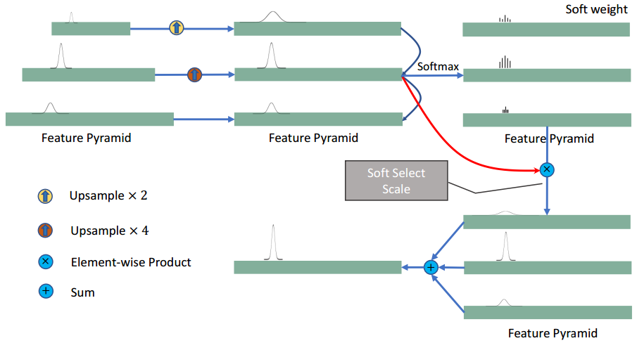

- Meta Data
  heading:: true
	- Title: RTM3D: Real-time Monocular 3D Detection from Object Keypoints for Autonomous Driving #readdone
	- Zotero Metadata
		- source [http://arxiv.org/abs/2001.03343](http://arxiv.org/abs/2001.03343)
		- #code https://github.com/Banconxuan/RTM3D
		- PDF Attachments
	- [Li et al_2020_RTM3D.pdf](zotero://open-pdf/library/items/NCHMGMTE)
		- [[abstract]]:
			- monocular 3D detection framework in [[single-shot]]
			- 传统方法
				- **projection constraint** from the 3D bounding box to the 2D box
					- 4 edges of a 2D box -> 4 constraints
					- the performance **deteriorates dramatically** with the small error of the 2D detector. 2D的微小误差会导致3D严重恶化 #related [[smoke]]
					  id:: 60193c1d-a8b3-4cc1-8ee7-80577c19e580
			- 提出的方法
				- 预测 9 perspective keypoints of a 3D bounding box in image space
				- utilize the **geometric relationship** of 3D and 2D perspectives to recover the dimension, location, and orientation in 3D space.
			- 效果
				- the properties of the object can be predicted **stably** even when the estimation of keypoints is very noisy,
					- enables us to obtain fast detection speed with a small architecture.
				- Training uses the 3D properties of the object 不需要 external networks or supervision data.
				- [[KITTI]] benchmark 数据集
		- zotero items: [Local library](zotero://select/items/1_I3PQK79E)
- Structure
  heading:: true
	- {:height 579, :width 751}
	- output main center heatmap, vertexes heatmap, and vertexes coordinate
- Keypoint Detectioin Network
  heading:: true
	- Backbone
	  heading:: true
		- [[ResNet]] and [[DLA]]
		- Downsample input image with $S=4$ factor
		- Upsample bottleneck thrice by 3 [[bilinear interpolation]]s and $1\times 1$ convolutional layer
		- After upsampling, the channels are 256, 128, 64.
	- Keypoint [[Feature Pyramid]]
	  heading:: true
		- [[FPN]] is not suitable because keypoints in the image have not different in size
			- 作者认为FPN更适合不同尺度的物体检测,对于keypoint没有意义
		- Propose new **KFPN**
		  heading:: true
			- {:height 387, :width 703}
			- detect scale-invariant keypoints in the **point-wise space**
			- $F$ scale feature maps, resize each scale $f$
				- $1 < f <F$ back to the size of maximal scale
				- yield feature map $\hat{f}_{1<f<F}$
			- 生成soft weight by a [[softmax]] 为每个scale分配重要性
			- Final scale-space score map $S_{score}$ by **linear weighting sum**
				-
				  $$S_{score}=\sum\limits_f \hat{f} \odot \rm{softmax}(\hat{f})$$
				- $\odot$ is element-wise product
	- Detection Head
	  heading:: true
		- 3 fundamental components
		- 6 optional components
			- arbitrarily selected to boost accuracy with a little computational consumption
		- 1. Inspired by [[centernet]], take a keypoint as the **main-center**
			- one point connects all features
			- Since the 3D projection point may exceed image boundary
				- 我们选择2D box center point
			- [[heatmap]] defined as $M\in{[0,1]^{\frac{H}{S}\times\frac{W}{S}\times C}}$
			  id:: 601bc1fd-63f7-4414-9ba1-46d0bc745a5e
				- $C$ is the number of object categories
		- 2. Another [[heatmap]] $V\in{[0,1]^{\frac{H}{S}\times\frac{W}{S}\times 9}}$
			- 9 perspective points projected by vertexes and center of 3D bounding box
		- 3. For keypoints association of one object, regress an local offset $V_c\in{R^{\frac{H}{S}\times\frac{W}{S}\times 18}}$
		  id:: 601bc1fd-5096-4749-b664-129aca28bc13
			- from the main-center as an indication.
			- Keypoints of $V$ closest to the coordinates from $V_c$ 被认为一个object上
			- $9\times 2$ offset用来约束9个vertexes点的位置
		- prior infomation可以进一步约束9个点
			- discretization error for each keypoint **offset regression**
				- center offset $M_{os}\in{R^{\frac{H}{S}\times\frac{W}{S}\times 2}}$
				- vertexes offset $V_{os}\in{R^{\frac{H}{S}\times\frac{W}{S}\times 2}}$
			- Dimension $D\in \mathbb{R}^{\frac{H}{S}\times\frac{W}{S}\times 2}$
			- Orientation $R(\theta)  \rightarrow O \in{R^{\frac{H}{S}\times\frac{W}{S}\times 8}}$ with 2 bins
			- Depth $Z \in{R^{\frac{H}{S}\times\frac{W}{S}\times 1}}$ of 3D box center
	- Training
	  heading:: true
		- 1. Keypoint training
			- The all heatmaps of keypoint training follows [[centernet]] and [[cornernet]]
			- TODO 这里增加centernet的工作流 #related [[centernet]] 
			  todo:: 1612150493417
			- The loss solves the imbalance of positive and negative samples with [[focal loss]]
				-
				  $$L_{kp}^{K}=-\frac{1}{N} \sum\limits_{k=1}^K \sum\limits_{x=1}^{H/S} \sum\limits_{y=1}^{W/S} \begin{cases} (1-\hat{p}_{kxy})^{\alpha} \log{(\hat{p}_{kxy})} \; \; & \; \rm{if} \; p_{kxy}=1 \\ (1-p_{kxy})^{\beta} \hat{p}_{kxy} \log{(1-\hat{p}_{kxy})} \; \; & \; \rm{otherwise}  \end{cases}$$
				- where $K$ is the channels of different keypoints
					- $K=C$ in maincenter
					- $K=9$ in vertexes
				- $\alpha$ and $\beta$ are hyper-parameters to reduce loss weight of negative and easy positive samples #[[focal loss]]
					- $\alpha=2$ and $\beta=4$ following centernet and cornernet
				- $p_{kxy}$ defined by [[Gaussian Kernel]] $p_{xy}=\exp{(-\frac{x^2+y^2}{2\sigma})}$
					- centered by ground truth keypoint $\tilde{p}_{xy}$
					- For $\sigma$, find the max area $A_{max}$ and min area $A_{min}$ of 2D box in training data and set 2 hyper-params $\sigma_{max}$ and $\sigma_{min}$
						- $\sigma=A(\frac{\sigma_{max}-\sigma_{min}}{A_{max}-A_{min}})$ for object with size $A$.
		- 2. Residual terms (to regress **dimension and distance**)
			-
			  $$L_D=\frac{1}{3N}\sum\limits_{x=1}^{H/S} \sum\limits_{y=1}^{W/S} \mathbf{1}^{obj}_{xy} \left( D_{xy}-\Delta \tilde{D}_{xy}\right)^2$$
				- where $\Delta \tilde{D}_{xy}=\log{\frac{\tilde{D}_{xy}-\bar{D}}{D_{\sigma}}}$
					- $\bar{D}$ and $D_{\sigma}$ are mean and standard deviation dimensions of training data
				- $\mathbb{1}_{xy}^{obj}$ if maincenter appears in position $x,y$
			-
			  $$L_Z=\frac{1}{N}\sum\limits_{x=1}^{H/S} \sum\limits_{y=1}^{W/S} \mathbb{1}^{obj}_{xy} \left( \log{Z_{xy}} - \log{\tilde{Z}_{xy}}\right)^2$$
		- 3. Offset training (maincenter, vertexes)
			- [[l1 distance]]
			-
			  $$L_{off}^m=\frac{1}{2N}\sum\limits_{x=1}^{H/S} \sum\limits_{y=1}^{W/S} \mathbb{1}^{obj}_{xy} \left| M_{os}^{xy}-\left(\frac{p^m}{S}-\tilde{p}_m \right)\right|$$
			-
			  $$L_{off}^v=\frac{1}{2N}\sum\limits_{x=1}^{H/S} \sum\limits_{y=1}^{W/S} \mathbb{1}^{ver}_{xy} \left| V_{os}^{xy}-\left(\frac{p^v}{S}-\tilde{p}_v \right)\right|$$
				- where $p^m$ and $p^v$ are the position of maincenter and vertexes in the original image
		- 4. The regression coordinate of vertexes with an [[l1 loss]]
			-
			  $$L_{ver}=\frac{1}{N}\sum\limits_{k=1}^8 \sum\limits_{x=1}^{H/S} \sum\limits_{y=1}^{W/S} \mathbb{1}^{ver}_{xy} \left| V_{c}^{(2k-1):(2k)xy}-\left| \frac{p^v-p^m}{S} \right| \right|$$
		- 5. Multi-task loss for keypoint detection
			-
			  $$L=\omega_{main}L_{kp}^C + \omega_{kpver}L_{kp}^8 + \omega_{ver}L_{ver} + \omega_{dim}L_{D}+ \omega_{ori}L_{ori} + \omega_{Z}L_{dis} + \omega_{off}^m L_{off}^m + \omega_{off}^v L_{off}^v$$
- 3D Bounding Box Estimate
  heading:: true
	- {{embed ((6017cf83-cea5-4a5c-b118-55af96d8aa7e)) }}
	- 总结一下,就是需要用 [[least squares]] 最小二乘优化一个reprojection error of 3D keypoints and 2D keypoints
		- 9个2D keypoints $\widehat{kp}_{ij}$, $\widehat{D}_i$, $\theta_i$
		- 3D boxes $R,T,D$
	- Camera-Point
	  heading:: true
		-
		  $$P_{3D}^i = \rm{diag} (D_i) \rm{Cor}$$
		-
		  later:: 1612240416554
		  id:: 601e644d-d5ac-473f-b30b-b4eb7fea9ad5
		  $$
		  \text { Cor }=\left[\begin{array}{ccccccccc}
		  0 & 0 & 0 & 0 & -1 & -1 & -1 & -1 & -1 / 2 \\
		  1 / 2 & -1 / 2 & -1 / 2 & 1 / 2 & 1 / 2 & -1 / 2 & -1 / 2 & 1 / 2 & 0 \\
		  1 / 2 & 1 / 2 & -1 / 2 & -1 / 2 & 1 / 2 & 1 / 2 & -1 / 2 & -1 / 2 & 0 \\
		  1 & 1 & 1 & 1 & 1 & 1 & 1 & 1 & 1
		  \end{array}\right]
		  $$
		- Then projection of 3D points
		- Then Define camera-point error
		- Then minimize the error with Jacobians in se(3) space
		- 参考 [[Visual SLAM]] 的 [[Optimization]]
	- Dimension-Prior
		-
		  $$e_d=\widehat{D}_i - D_i$$
	- Rotation-Prior
		-
		  $$e_r=\log{\left(R^{-1}R(\hat{\theta})\right)_{se(3)}^{\vee}}$$
			- map the error in tangent vector space