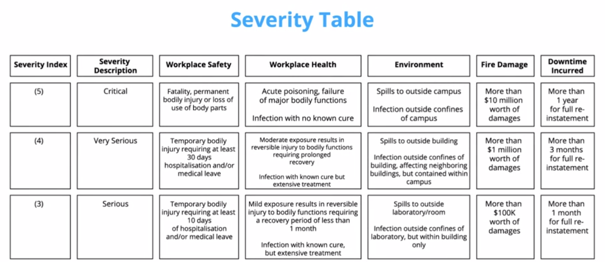
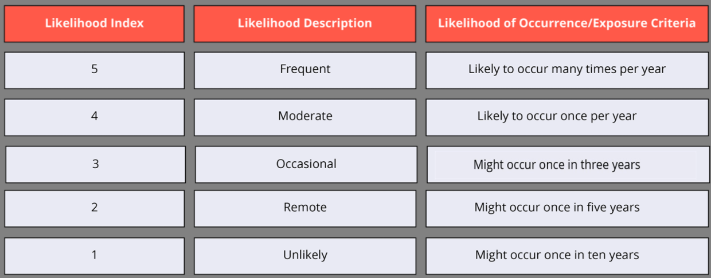
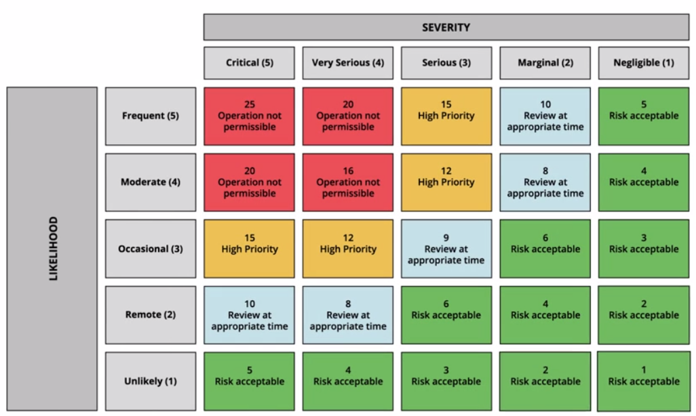
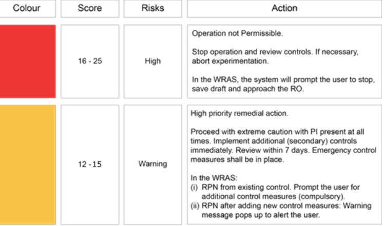
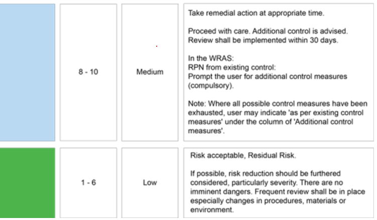
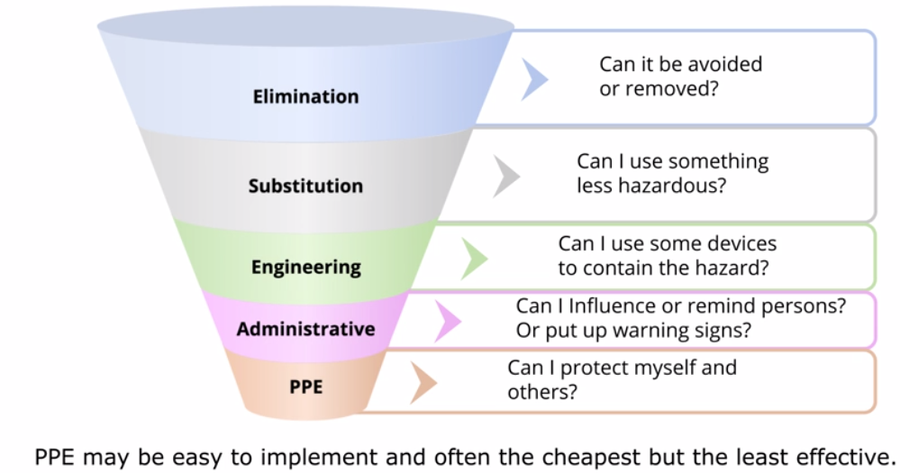

- Anti terrorist
	- Vigilance
	  collapsed:: true
		- pay attention to surroundings and keep a lookout for
			- unattended items in public areas
				- especially partially hidden
			- suspicious behaviours
		- If encounter issues
			- police 999 or SMS to 71999
			- Send information via SGSecure APP
	- Cohesion
	  collapsed:: true
		- Stay united
		- Build strong bonds, deepen trust and respect by
			- Get to know and help neighbours
			- understanding, considerate and respectful of one another
		- After an attack occurred
			- stay calm
			- don't spread rumors, post or share videos or photos that cause worry and panic
			- stay informed via official sources
	- Resilience
	  collapsed:: true
		- Stay strong
		- Be prepared and know what to do in an emergency
			- Get trained in emergency preparedness skills
				- basic first aid
				- CPR-AED
		- Know and apply
			- Run
				- don't surrender or attempt to negotiate
				- consider the safest route
				- move quickly and quietly
				- stay out of view of the attackers
				  id:: 60d6fad4-7efa-496f-a034-2eec2f8f87ed
				- insist others leave with you
				- leave belongings.
			- Hide
				- If escape is not possible, try to hide
				- find a good cover and stay out of sight
				- lock yourself but do not get trapped
				- If no lock, place heavy objects behind the doors or entrances
				- move away from the doors
				- Be quiet and switch phone to silent mode
			- Tell
				- Call or SMS
				- Give locations and where you last saw the attackers
				- Provide details
					- total number of attackers
					- equipment or weapons being carried
					- Look of attackers
					- Location of attackers
			- improvised First-Aid Skills (IFAS)
				- Press
				- Tie
				- Tell
- Risk assessment
	-
	  1. hazard identification
	  id:: 60d72277-be19-4403-9fbd-67a830e6056d
	-
	  2. risk evaluation
		- Severity
			- {:height 369, :width 840}
		- Likelihood
			- {:height 309, :width 761}
		- Risk Prioritisation Number (RPN)
			- {:height 449, :width 731}
			- Action table
				- {:height 316, :width 522}
				- {:height 308, :width 522}
	-
	  3. Risk Control
		- 5 hierarchical levels (priority top -> down)
			- Elimination
			- Substitution
				- change process or material
			- Engineering
				- deny access to hazard by erecting a physical barrier
				- use a machine
			- Administrative
				- ensure adherence to procedures, instructions or notices and warnings
			- PPE (Personal Protective Equipment)
				- as a last resort
		- {:height 318, :width 588}
		-
-
-
-
-
-