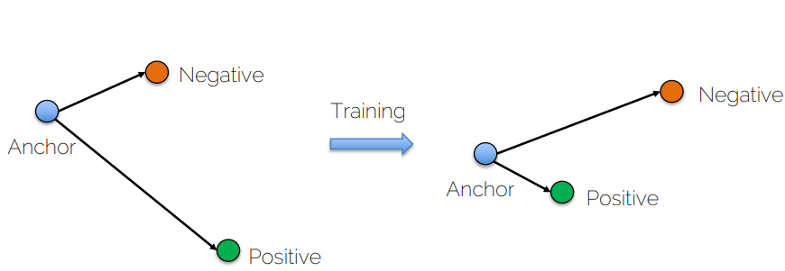

- **Scalability**: for [[supervised]] learning: need to retrain new objects not in our training samples.
- 1. Similarity Learning
  heading:: true
    - Siamese network = shared weights
        - Obtain an encoding of the image $f(A)$
        - Compare the encodings
            - Distance function $d(A, B)=|| f(A) - f(B)||^2$
            - Training: learn the parameters such that
                - if A and B depict the same object, $d(A, B)$ is small
                - if A and B depict different objects, $d(A, B)$ is big
        - Loss function for a **positive** pair
            -
              $$\mathcal{L}(A,B)=|| f(A)-f(B)||^2$$
        - Loss function for a **negative** pair
            - Better use a [[hinge loss]]
            -
              $$\mathcal{L}(A,B)=\max (0, m^2-|| f(A)-f(B)||^2)$$
            - Brings the elements further apart up to a margin $m$
            - If two elements are already far away, do not spend energy in pulling them even further away.
        - [[Contrastive Loss]]
            - {{embed ((602dca30-8789-4c00-8cc9-b034eccd08d8)) }}
    - Training
      heading:: true
        - Update the weights for each channel independently and ^^average^^ them
- 2. Triplet Loss
  heading:: true
    - Triplet loss allows us to learn a **ranking** among _anchor_ samples (A), positive samples (P) and negative ones (N).
    - We want $|| f(A)-f(P)||^2<|| f(A)-f(N)||^2$
    - [[Hard Negative Mining]]
        - ((602dcba9-ab4b-4e7e-8477-78254183d3ec))
        - 
        -