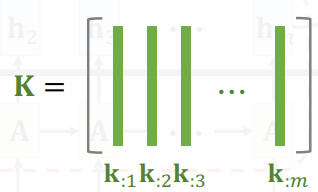

- [[sequence-to-sequence]] model by using [[self-attention]]
    - The original paper: [[Attention is all you need]] , NIPS, 2017. #related
    - Purely based [[attention]] and dense layers ( [[fully connected layer]] )tt
    - 整个结构就是用 [[attention]]层和 [[self-attention]]层组成的
    - Higher accuracy than [[RNN]]s on large datasets
    - **permutation invariant**
- 相关资料
    - tutorial
        - {{youtube https://www.youtube.com/watch?v=aButdUV0dxI&t=30s}}
- 回忆 attention
  heading:: true
    - {{embed ((603070b8-5a03-4cf9-a04b-6defdb8f56e7)) }}
- 剥离RNN,保留 [[attention]]
  heading:: true
    - 1. 计算**Key** $\mathbf{k}_{:i}=\mathbf{W}_K\mathbf{h}_i$ 和 **Query** $\mathbf{q}_{:j}=\mathbf{W}_Q\mathbf{s}_j$
        - 其中$\mathbf{W}_K,\mathbf{W}_Q$是Parameter matrices,从训练data里学习
        - **Query**用来匹配Key值,在decoder中生成第$j$个状态向量时使用
        - **Key**用来被Query匹配,相当于数据库,是encoder中已经学习到的
        - $m$个$k_i$向量组成大$\mathbf{K}$矩阵
            - {:height 200, :width 705}
    - 2. 计算weights: $\mathbf{\alpha}_{:j}=\rm{Softmax}\left(\mathbf{K}^{\top} \mathbf{q}_{:j}\right)\in{\mathbb{R}^m}$
      id:: 603216e2-71c1-4006-9977-3f2577cd5c65
        - 又叫**Attention scores**
        - {:height 113, :width 169}
        - 这些weights介于0,1之间,相加为1
        - 拿一个query $j$来对比所有key向量$\mathbf{K}$
            - 得到的$\mathbf{\alpha}_{:j}$就是query $j$和每个key的匹配程度
    - 3. 除了query和key,还有**Value**: $\mathbf{v}_{:i}=\mathbf{W}_V\mathbf{h}_i$
        - To be weighted averaged
    - 4. 计算 Context Vector
      heading:: true
        - 
        - 用这$m$个weights $\alpha_{:j}$与这$m$个向量 $\mathbf{v}_{:i}$做加权平均
          id:: 603216e2-c974-4adf-ae94-0d8df86d6685
        - $\mathbf{c}_j=\alpha_{1j}\mathbf{v}_{:1} + \cdots + \alpha_{mj}\mathbf{v}_{:m}$
- Attention Layer in [[attention]] without [[RNN]]
  heading:: true
  background_color:: #793e3e
    - Encoder's inputs are vectors $\mathbf{X}=\left[\mathbf{x}_1, \mathbf{x}_2, \cdots, \mathbf{x}_m\right]$
      id:: 603216e2-4340-4642-b5b4-182b3724d859
    - Decoder's inputs are vectors $\mathbf{X}^{\prime}=\left[\mathbf{x}_1^{\prime}, \mathbf{x}_2^{\prime}, \cdots, \mathbf{x}_t^{\prime}\right]$
      id:: 603216e2-3a05-4d05-b04f-736715f15c89
    - 这仍然是个 [[sequence-to-sequence]] 模型
    - **keys** and **values** are based on encoder's inputs
      heading:: true
        - keys: $\mathbf{k}_{:i}=\mathbf{W}_K \mathbf{x}_i$
        - value: $\mathbf{v}_{:i}=\mathbf{W}_V \mathbf{x}_i$
        - [attention layer](https://i.imgur.com/lRuneZW.png)
    - **queries** are based on decoder's inputs
      heading:: true
        - Query: $\mathbf{q}_{:j}=\mathbf{W}_Q \mathbf{x}_j^{\prime}$
    - Compute **weights**: $\alpha_{:1}=\rm{Softmax}(\mathbf{K}^{\top}\mathbf{q}_{:1})\in{\mathbb{R}^m}$.
        - [a1](https://i.imgur.com/MtGhesX.png)
    - Compute **context vector**: $\mathbf{c}_{:1}=\alpha_{11} \mathbf{v}_{:1} + \cdots + \alpha_{m1} \mathbf{h}_{:m}=\mathbf{V\alpha}_{:1}$
        - [c1](https://i.imgur.com/vAiQ7AO.png){:height 286, :width 727}
    - Compute **weights**: $\alpha_{:2}=\rm{Softmax}(\mathbf{K}^{\top}\mathbf{q}_{:2})\in{\mathbb{R}^m}$.
    - Repeat until
        - Output of attention layer $\mathbf{C} = [\mathbf{c}_{:1}, \mathbf{c}_{:2}, \cdots, \mathbf{c}_{:t}]$.
        - $\mathbf{c}_{:j}=\mathbf{V} \cdot \rm{Softmax}\left(\mathbf{K}^{\top}\mathbf{q}_{:j}\right)$.
            - Thus $\mathbf{c}_{:j}$ is a function of $\mathbf{x}_j^{\prime}$ and $[\mathbf{x}_1, \cdots, \mathbf{x}_m]$.
            - $\mathbf{c}_{:j}$依赖于decoder一个输入$\mathbf{x}_j^{\prime}$以及decoder全部的输入
    - 生成过程
      heading:: true
        - {:height 285, :width 239}
        - 例如上图,生成的$\mathbf{c}_{:2}$作为特征向量输入 [[softmax]] 分类其得到概率分布$\mathbf{p}_2$
        - 通过$\mathbf{p}_2$进行抽样得到第三个单词,编码成$\mathbf{x}_3^{\prime}$作为下一轮输入
        -
          #+BEGIN_NOTE
          这里跟[[RNN]]不同的是用**context vector**作为特征向量
          RNN使用状态$\mathbf{h}$作为特征向量
          #+END_NOTE
    - Attention layer: $\mathbf{C}=\rm{Attn}\left(\mathbf{X, X}^{\prime}\right)$.
      heading:: true
        - ((603216e2-4340-4642-b5b4-182b3724d859))
        - ((603216e2-3a05-4d05-b04f-736715f15c89))
        - Parameters $\mathbf{W}_Q, \mathbf{W}_K, \mathbf{W}_V$
        - [atten layer](https://i.imgur.com/5yTcLzG.png)
- Attention Layer in [[self-attention]] without [[RNN]]
  heading:: true
  background_color:: #49767b
    - 不是 [[sequence-to-sequence]],只有一个输入序列
    - $\mathbf{C}=\rm{Attn}\left(\mathbf{X,X}\right)$.
        - Inputs: $\mathbf{X}=[\mathbf{x}_1, \mathbf{x}_2, \cdots, \mathbf{x}_m]$
        - Parameters $\mathbf{W}_Q, \mathbf{W}_K, \mathbf{W}_V$
        - [self-atten](https://i.imgur.com/x9iLP0L.png)
    -
      #+BEGIN_NOTE
      $\mathbf{c}_{:2}$并非只依赖于$\mathbf{x}_2$而是所有输入向量
      #+END_NOTE
    - **步骤**
      heading:: true
        - 1. 三种变换
            - 
            - 每个$\mathbf{x}_j$向量都会被映射成三个向量
            - {:height 145, :width 703}
        - 2. 计算**weights** 权重向量
            - ((603216e2-71c1-4006-9977-3f2577cd5c65))
            - {:height 223, :width 492}
        - 3. 计算**context vector**
            - $\mathbf{c}_{:j}=\alpha_{1j}\mathbf{v}_{:1}+\cdots+\alpha_{mj}\mathbf{v}_{:m}=\mathbf{V\alpha}_{:j}$
            - {:height 233, :width 496}
            - ((603216e2-c974-4adf-ae94-0d8df86d6685))
        - 4. Output就是$\mathbf{c}$
            - {:height 309, :width 547}
    - Single-Head [[self-attention]]
        - As seen above which is called "single-head self-attention"
- Multi-Head [[self-attention]]
  heading:: true
  id:: 602f1494-1008-4ce6-8660-be856c3cfecd
  background_color:: #497d46
    - 多头的好处 advantages of multi-head #pros
        - 扩展了模型专注于不同位置的能力
        - 给出了[[attention]] layer的多个"表示子空间"
            - 多个query/key/value的权重矩阵set
            - 比如一般使用8个attention head,因此每个encoder/decoder 有8个矩阵集合
            - 这些最后再concatenate起来
    - Using $l$ single-head self-attentions (^^Do not share parameters^^)
        - A single-head self-attention has 3 paramter matrices: $\mathbf{W}_Q, \mathbf{W}_K, \mathbf{W}_V$.
        - Totally $3l$ parameters matrices.
    - Concatenating outputs of single-head ones
      heading:: true
        - Single-head outputs are $d\times m$ matrices
        - Multi-head output shape: $(ld)\times m$.
        - 每个single-head self-attentions或者attentions有相同的输入序列,只是参数矩阵各不相同
        - 
    - Self-Attention Layer + Dense Layer
      heading:: true
        - 
        -
          #+BEGIN_NOTE
          这里各个Dense全连接层都是相同的 [[fully connected layer]]
          它们的参数矩阵都是$\mathbf{W}_U$
          #+END_NOTE
        - 得到$m$个输出向量$\mathbf{u}_{:j}$
- Stacked Self-Attention Layers
  heading:: true
    - {:height 321, :width 583}
    - $u_{:j}$会收到所有输入向量的影响,不过影响最大的还是$\mathbf{x}_j$
    - Transformer's Encoder
      heading:: true
        - One block of encoder
            - {:height 225, :width 273}
        - Encoder 结构
            - {:height 319, :width 219}
                - 一般有6个blocks
                    - 每个block有2层
                    - 每个block有自己的参数,互相独立
- Stacked Attention Layers
  heading:: true
    - Transformer decoder的一个block
      heading:: true
        - 第一层是multi-head self-attention
            - {:height 172, :width 324}
            - 输入输出全都是$512\times t$向量
        - 第二层是multi-head attention layer
            - 输入是两个序列
            - {:height 225, :width 525}
            - 输出的也是$512$的向量
        - 最后一个dense layer
            - {:height 294, :width 248}
        - 合起来就是一个block
            - {:height 265, :width 263}
- 最终的Transformer模型
  heading:: true
    - {:height 303, :width 517}
    - 最后输入到[[FFN]]
        - The [[Pointwise]] [[fully connected layer]] is called [[feed forward network]]
          id:: 602f1494-f1af-496b-88e8-0890899d2c25
            - linear transformers
            - non-linear [[activation function]]s
    - 实际流程
        - {:height 570, :width 415}
        - Encoder
            - multihead attention 上面还有Add & Norm层
                - Add表示residual connection, 防止网络退化
                - Norm表示[[layer normalization]], 用于对每一层的激活值进行归一化
                - 一个sequence $I\in R(d,N)$经过一个multi-head attention得到$O\in R(d,N)$
                    - 然后将输入输出相加再做layer normalization
            - 绿色的block重复$N$次
            - 接着是 [[FFN]]
        - Decoder
            - 1. masked multi-head self-attention
                - "masked" 使attention只会attend on 已经产生的sequence
                - 训练时确保第$i$个位置不会接触到未来的信息
            - 2. 下一层的attention的key和value来自encoder,query来自上一位置decoder的输出
- Vision based Transformer
  heading:: true
    - [[ViT]]
    - Input
      heading:: true
        - transformer输入需要sequence
            - 对一幅图像切分为path -> sequence
            - 降维
        - 
        - 如上图,在9个块的基础上追加一个0和
            -