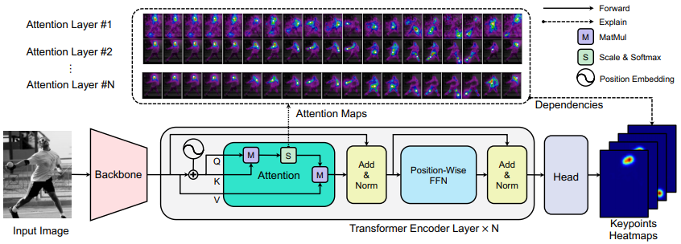

- TransPose: Towards Explainable Human Pose Estimation by Transformer #readdone
	- Zotero Metadata
		- [http://arxiv.org/abs/2012.14214](http://arxiv.org/abs/2012.14214)
		- PDF Attachments
	- [2020_Yang et al_arXiv2012.14214 [cs]_TransPose.pdf](zotero://open-pdf/library/items/UKDFNMGQ)
		- [[abstract]]:
			- CNNs have made remarkable progress on human pose estimation task. However, there is no explicit understanding of how the locations of body keypoints are predicted by CNN, and it is also unknown what **spatial dependency relationships** between structural variables are learned in the model.
			- To explore these questions, we construct an explainable model named TransPose based on Transformer architecture and **low-level convolutional blocks**.
				- Given an image, the attention layers built in Transformer can capture long-range spatial relationships between keypoints and explain what dependencies the predicted keypoints locations highly rely on.
				- We analyze the rationality of using attention as the explanation to reveal the spatial dependencies in this task.
					- The revealed dependencies are image-specific and variable for different keypoint types, layer depths, or trained models.
			- The experiments show that TransPose can accurately predict the positions of keypoints. It achieves state-of-the-art performance on COCO dataset, while being more interpretable, lightweight, and efficient than mainstream fully convolutional architectures.
		- zotero items: [Local library](zotero://select/items/1_3ZFKCMW6)
- 0. CNN很难解释模型的原因
  heading:: true
	- 1) Deepness
		- CNN too deep to figure out what role each layer plays, especially high-level layers
	- 2) Relationships and features coupled
		- Global spatial relationships between body parts are not only implicitly encoded in the parameters of convolution kernels, but also expressed in the activations of neurons.
	- 3) Limited memory for large numbers of images
- 1. Strucuture
  heading:: true
	- 
	- [[query-key]] attention iteratively capture dependencies from current sequence
	- 1) Backbone
		- [[ResNet]]
		- [[HRNet]]
	- 2) Transformer
		- Only the encoder
			- compress image into a compact positions representation of keypoints.
			- $I\in \mathbb{R}^{3\times H_I \times W_I} \rightarrow \mathbf{X}_f \in \mathbb{R}^{d\times H \times W}$ feature
			- Then feature map flattened into a sequence $\mathbf{X}\in \mathbb{R}^{L\times d}$
				- $L=H\times W$
	- 3) Head
		- Encoder output $\mathbf{E}\in \mathbb{R}^{L\times d}$ as _input_
		- reshape $\mathbf{E}$ to $\mathbb{R}^{C\times H \times W}$ shape
		- predict $K$ types of keypoints heatmaps $P\in \mathbb{R}^{K\times H^* \times W^*}$
			- $H^*,W^*=H_I/4, W_I/4$
- 2. Method
  heading:: true
	- Resolution Setting
	- Position Embedding
		- 2D sine and cosine positional encoding to input embeddings #related [[DETR]]
	- Multi-head self-attention
	  heading:: true
		- _Project_ an input sequence $\mathbf{X}\in \mathbb{R}^{L\times d}$ into queries $\mathbf{Q}\in \mathbb{R}^{L\times d}$, keys $\mathbf{K}\in \mathbb{R}^{L\times d}$ and values $\mathbf{V}\in \mathbb{R}^{L\times d}$ by 3 matrices $\mathbf{W}_q, \mathbf{W}_k, \mathbf{W}_v \in \mathbb{R}^{d\times d}$
			-
			  #+BEGIN_PINNED
			  position embedding 不会放到$\mathbf{V}$前面
			  #+END_PINNED
		- **attention scores** matrix $\mathbf{A}\in \mathbb{R}^{N\times N}$
			-
			  $$\mathbf{A} = \rm{softmax}\left( \frac{\mathbf{QK}^{\top}}{\sqrt{d}}\right)$$
			- Each query $\mathbf{q}_i \in \mathbb{R}^{d}$ belonging to ^^token^^ (feature vector) $x_i=\mathbf{X}_i^{\top}$ computes similarities with all the keys to
				- achieve a weight vector $\mathbf{w}_i=\mathbf{A}_{i,:} \in \mathbb{R}^{1\times L}$
					- determines how much dependency is needed from each token in the previous sequence for a new token
			- Incremental update ( [[residual blocks]] ) for $x_i$ is achieved by linearly combining each value in Value matrix $\mathbf{Q}$ with corresponding weight in $\mathbf{w}_i$
				- the attention maps can be seen as **dynamic weights**
					- store the similarities dependent on the current input context or feature activations
					- and weight the distributions in the forward propogation
			- [[Pairwise]] and global interactions mostly occur at the **attention layers**.
				- CNN的作用更多是在limited local patch 上提取feature
			-