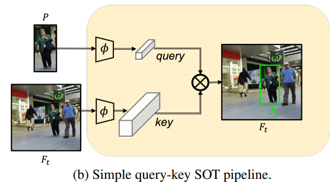
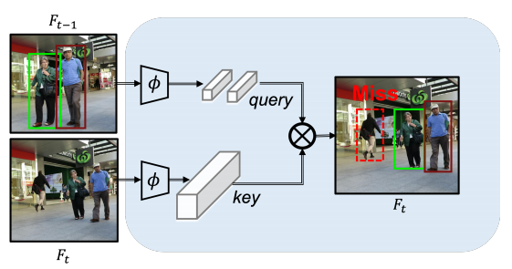
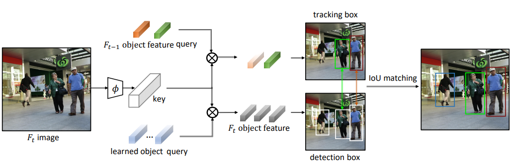
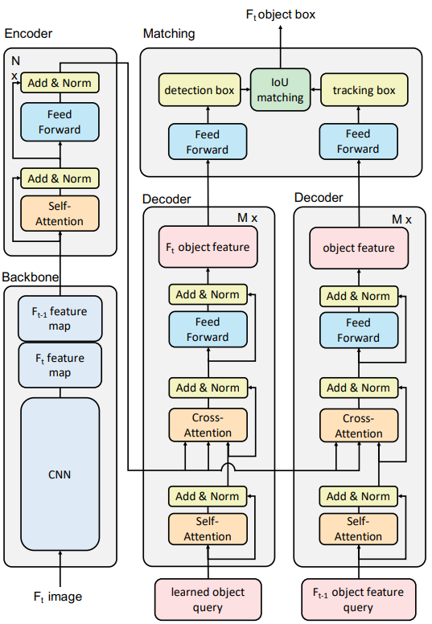

## TransTrack: Multiple-Object Tracking with Transformer #toread
### Zotero Metadata
#### #code  https://github.com/PeizeSun/TransTrack
#### apper: [http://arxiv.org/abs/2012.15460](http://arxiv.org/abs/2012.15460)
#### PDF Attachments
	- [Sun et al_2020_TransTrack.pdf](zotero://open-pdf/library/items/2YJ93IDV)

#### [[abstract]]:
##### Multiple-object tracking(MOT) is mostly dominated by complex and multi-step [[tracking-by-detection]] algorithm, which performs object detection, feature extraction, and temporal association, separately.
##### ^^query-key^^ mechanism in single-object tracking(SOT), which tracks the object of the current frame by object feature of the previous frame, has great potential to set up a simple _joint-detection-and-tracking_ MOT paradigm.
###### {:height 211, :width 359}
###### Nonetheless, the query-key method is seldom studied due to its inability to detect new-coming objects.
####### {:height 211, :width 388}
##### In this work, we propose **TransTrack**, a baseline for MOT with Transformer.
###### It takes advantage of ^^query-key^^ mechanism and introduces a set of learned object queries into the pipeline to enable detecting new-coming objects.
##### **TransTrack** has 3 main advantages:
###### (1) It is an online joint-detection-and-tracking pipeline based on _query-key_ mechanism. Complex and multi-step components in the previous methods are **simplified**.
###### (2) It is a brand new architecture based on _Transformer_. The learned object query detects objects in the current frame. The object feature query from the previous frame associates those current objects with the previous ones.
###### (3) For the first time, we demonstrate a much simple and effective method based on query-key mechanism and Transformer architecture could achieve competitive 65.8\% MOTA on the MOT17 challenge dataset.
#### zotero items: [Local library](zotero://select/items/1_H36YUSUS)
## 1. Pipeline
:PROPERTIES:
:heading: true
:END:
### 
### Both object feature query from previous frame and learned object query are taken as input query
#### query两个分支分别来自上一帧目标特征query集与一个learned object query集
#### Learned object query detects objects in the current frame #related [[DETR]]
##### decoded into **detection boxes** on each frame
##### provide common object detection
#### Object feature query from previous frame $F_{t-1}$  #related [[CenterTrack]]
##### 上一帧检测分支产生的object feature vector
##### 位移预测, **object propagation**
##### decoded into **tracking boxes**
##### associates objects of current frame with previous ones
### Image feature map as **common key**
### 
#### current and previous frames are fed into _encoder_ to generate composite feature.
#### learned object query decoded into detection boxes
#### object feature of previous frame decoded into tracking boxes
##### 上一帧目标在当前帧的位置预测
#### Box Association
##### [[IoU]] matching to associate detection and tracking boxes
##### apply [[Kuhn-Munkres]] algorithm to IoU similarity of detection boxes and tracking boxes
###### unmatched detection boxes are added as new objects
### Built on **transformer** with [[Encoder-decoder]], with stacked multi-head attention layers and point-wise fully connected layers
#### ((602f149c-8acd-4c88-ba97-c4e189bd8f16))
#### ((602f1494-f1af-496b-88e8-0890899d2c25))
#### Encoder generates keys and decoder takes as input task-specific queries
### The encoder takes the composed feature maps of 2 consecutive frames as input
:PROPERTIES:
:id: 603070b4-7f4c-40cc-bc24-59e0d20ea247
:END:
#### catch useful _correlations_
## 2. Training
:PROPERTIES:
:heading: true
:END:
### Training Loss
:PROPERTIES:
:heading: true
:END:
#### 同时train 2 decoders
#### set prediction loss
##### predict classification and box coordinates
##### set-based loss produces an optimal [[bipartite graph matching]] between predictions and gt
##### 1. matching loss for training detection boxes
######
$$\mathcal{L} = \lambda_{cls}\cdot \mathcal{L}_{cls} +\lambda_{L1}\cdot \mathcal{L}_{L1} +\lambda_{giou}\cdot \mathcal{L}_{giou}$$
####### $\mathcal{L}_{cls}$ is [[focal loss]] of category labels
####### $\mathcal{L}_{L1}$ normalized center coordinates
####### $\mathcal{L}_{giou}$ (generalized [[IoU]] loss) height and width
##### 2. matching loss for training tracking boxes
###### optimal bipartite matching is removed
###### matching index directly from detection boxes in the previous frame
###### training loss is the same as 1
### Inference
:PROPERTIES:
:heading: true
:END:
#### Track Rebirth
:PROPERTIES:
:heading: true
:END:
##### to enhance robustness to occlusions and short-term disappearing
##### if a tracking box is unmatched, keeps as ^^inactive^^ until remains unmatched for $K$ consecutive frames
###### $K=32$ here
##### Inactive can be matched and regain ID.
#####
