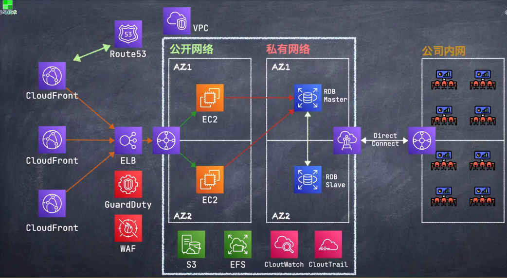

- 问题
    - 几台服务器
    - 每个服务器的功能(Web, Cache, DB, ...)
    - 需要什么硬件配置的服务器(CPU, MEM, HDD/SDD, 网卡 ...)
    - 服务器放在哪儿 (IDC, Cloud, ...)
    - 需要什么软件 (Apache, Nginx, Tomcat, MySQL, PostgresSQL, ...)
    - 网络构成怎样 (客户端,中间层,服务层,数据层,分析层, AI层, ...)
    - 网络IP该如何规划 (根据角色分配IP范围)
    - 需要几个子网 (对外公开,对内公开)
    - 如何设计网络完全 (服务访问授权,跟踪行为,数据加密,传输加密,WAF, DDoS, ...)
    - 如何与本地连接 (公司内网与云端通信机制)
    - 如何提高服务可用性 (负载均衡,多区域部署)
    - 如何节省成本 (性价比)
- 
-